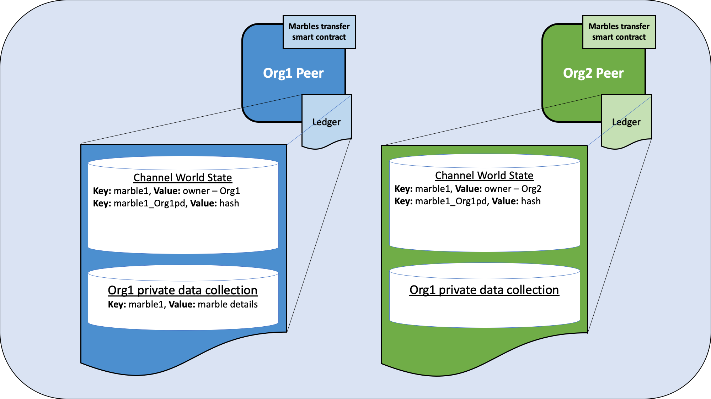
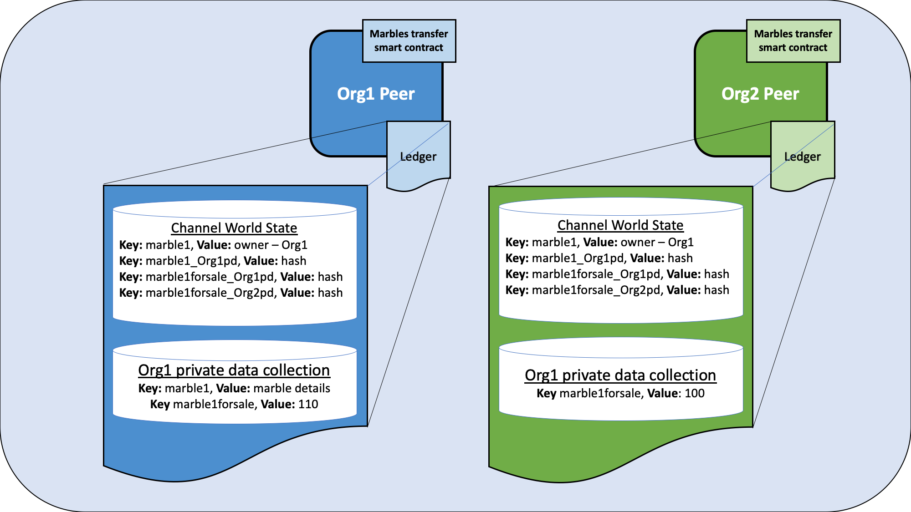
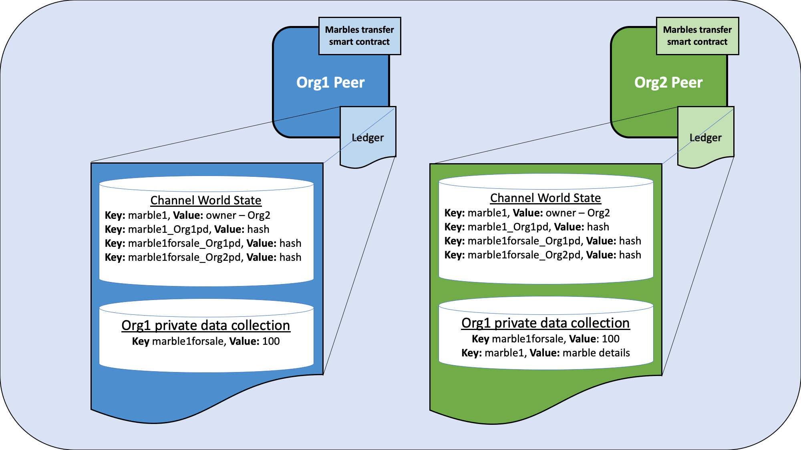

# Marbles private asset transfer scenario

The marbles transfer smart contract demonstrates how an asset can be represented and traded between organizations in a Hyperledger Fabric blockchain channel, while keeping details of the asset and transaction private.
Each on-chain marble is a non-fungible token (NFT) that represents a specific marble having certain immutable metadata properties (such as size and color) with a unique owner. When the owner wants to sell the marble, both parties need to agree to the same price before the marble is transferred. The marbles transfer smart contract enforces that only the owner of the marble can transfer the marble. In the course of this tutorial, you will learn how Fabric features such as state based endorsement, private data, and access control come together to provide secured transactions that are both private and verifiable.

## Scenario requirements

The marbles transfer scenario is bound by the following requirements:

- A marble may be issued by the first owner's organization (in the real world issuance may be restricted to some authority that certifies a marble's properties).
- Ownership is managed at the organization level (the Fabric permissioning scheme would equally support ownership at an individual identity level within an organization).
- The marble identifier and owner is stored as public channel data for all channel members to see.
- The marble metadata properties however are private information known only to the asset owner (and prior owners).
- An interested buyer will want to verify a marble's private properties.
- An interested buyer will want to verify a marble's provenance, specifically the marble's origin and chain of custody. They will also want to verify that the marble has not changed since issuance, and that all prior transfers have been legitimate.
- To transfer a marble, a buyer and seller must first agree on a sales price.
- Only the current owner may transfer their marble to another organization.
- The actual marble transfer must verify that the legitimate marble is being transferred, and verify that the price has been agreed to. Both buyer and seller must endorse the transfer.

## How privacy is maintained

The smart contract uses the following techniques to ensure that the marble properties remain private:

- The marble metadata properties are stored in the current owning organization's implicit private data collection on the organization's peers only. Each organization on a Fabric channel has a private data collection that their own organization can use. This collection is *implicit* because it does not need to be explicitly defined in the chaincode.
- Although a hash of the private properties is automatically stored on-chain for all channel members to see, a random salt is included in the private properties so that other channel members cannot guess the private data preimage through a dictionary attack.
- Smart contract requests utilize the transient field for private data so that private data does not get included in the final on-chain transaction.
- Private data queries must originate from a client whose org id matches the peer's org id, which must be the same as the marble owner's org id.

## How the transfer is implemented

Before we start using the marbles transfer smart contract we will provide an overview of the transaction flow and how Fabric features are used to protect the asset created on the blockchain:

**Step 1: Creating the marble**

The marbles transfer smart contract is deployed with an endorsement policy that requires an endorsement from any channel member. This allows any organization to create a marble that they own without requiring an endorsement from other channel members. The creation of the marble is the only transaction that uses the chaincode level endorsement policy. Transactions that update or transfer existing marbles will be governed by state based endorsement policies or the endorsement policies of private data collections. Note that in other scenarios, you may want an issuing authority to also endorse create transactions.

The smart contract uses the following Fabric features to ensure that the Marble can only be updated or transferred by the organization that owns the marble:

- When the marble is created, the smart contract gets the MSP ID of the organization that submitted the request, and stores the MSP ID as the owner in the marble key/value in the public chaincode world state. Subsequent smart contract requests to update or transfer the marble will use access control logic to verify that the requesting client is from the same organization. Note that in other scenarios, the ownership could be based on a specific client identity within an organization, rather than an organization itself.
- Also when the marble is created, the smart contract sets a state based endorsement policy for the marble key. The state based policy specifies that a peer from the organization that owns the marble must endorse a subsequent request to update or transfer the marble. This prevents any other organization from updating or transferring the marble using a smart contract that has been maliciously altered on their own peers.

**Step 2: Agreeing to the transfer.**

After a marble is created, channel members can use the smart contract to agree to transfer the marble:

- The owner of the marble can change the description in the public ownership record, for example to advertise that the marble is for sale. Smart contract access control enforces that this change needs to be submitted from a member of the marble owner organization. The state based endorsement policy enforces that this description change must be endorsed by a peer from the owner's organization.
<!--
- Interested buyers can ask the current owner for the private details, and then verify those details against the on-chain hash on their own trusted peer.
- An interested buyer can query the history of the public key. The response includes all transactions that updated the key. Each of those transactions can be inspected to verify the marble's origination, the chain of custody, and that the marble private details hash has not changed since issuance.
-->

The marble owner and the marble buyer agree to transfer the marble for a certain price:
- The price agreed to by the buyer and the seller is stored in each organization's implicit private data collection. The private data collection keeps the agreed price secret from other members of the channel. The endorsement policy of the private data collection ensures that the respective organization's peer endorsed the price agreement, and the smart contract access control logic ensures that the price agreement was submitted by a client of the associated organization.
- A hash of each price agreement is stored on the ledger. The two hashes will match only if the two organizations have agreed to the same price. This allows the organizations to verify that they have come to agreement on the transfer details before the transfer takes place. A random trade id is added to the price agreement, which serves as a *salt* to ensure that other channel members can not use the hash on the ledger to guess the price.

**Step 3: Transferring the marble**

After the two organizations have agreed to the same price, the marble owner can use the transfer function to transfer the marble to the buyer:

- Smart contract access control ensures that the transfer must be initiated by a member of the organization that owns the marble.
- The transfer function verifies that the marble details passed to the transfer function matches the on chain hash, to ensure that the marble owner is *selling* the same marble that they own.
- The transfer function uses the hash of the price agreement on the ledger to ensure that both organizations have agreed to the same price.
- If the transfer conditions are met, the transfer function adds the marble to the implicit private data collection of the buyer, and deletes the marble from the collection of the seller. The transfer also updates the owner in the public ownership record.
- Because of the endorsement policies of the seller and buyer implicit data collections, and the state based endorsement policy of the public record (requiring the seller to endorse), the transfer needs to be endorsed by peers from both buyer and seller.
- The state based endorsement policy of the public marble record is updated so that only a peer of the new owner of the marble can update or sell their new marble.

## Running the marbles transfer smart contract

You can use the Fabric test network to run the marbles transfer smart contract. The test network contains two peer organizations, Org1 and Org1, that operate one peer each. In this tutorial, we will deploy the smart contract to a channel of the test network joined by both organizations. We will first create a marble that is owned by Org1. After the two organizations agree on a marble price, we will transfer the marble from Org1 to Org2.

## Deploy the test network

We need to deploy an instance of the Fabric test network to run the smart contract. Open a command terminal and navigate to test network directory in your local clone of the `fabric-samples`. We will operate from the `test-network` directory for the remainder of the tutorial.
```
cd fabric-samples/test-network
```

You can then deploy the network with the following command:
```
./network.sh up createChannel
```
The script will deploy the nodes of the network create a single channel named `mychannel` with Org1 and Org2 as channel members. We will use this channel to deploy the smart contract and trade our marble.

### Set the environment variables to operate as Org1

In the course of running this sample, you need to interact with the network as both Org1 and Org2. To make the tutorial easier to use, we will use separate terminals for each organization. Open a new terminal and make sure that you are operating from the `test-network` directory. Set the following environment variables to operate the `peer` CLI as the Org1 admin:
```
export PATH=${PWD}/../bin:${PWD}:$PATH
export FABRIC_CFG_PATH=$PWD/../config/
export CORE_PEER_TLS_ENABLED=true
export CORE_PEER_LOCALMSPID="Org1MSP"
export CORE_PEER_MSPCONFIGPATH=${PWD}/organizations/peerOrganizations/org1.example.com/users/Admin@org1.example.com/msp
export CORE_PEER_TLS_ROOTCERT_FILE=${PWD}/organizations/peerOrganizations/org1.example.com/peers/peer0.org1.example.com/tls/ca.crt
export CORE_PEER_ADDRESS=localhost:7051
```
The environment variables also specify the endpoint information of the Org1 peer to submit requests.

### Set the environment variables to operate as Org2

Now that we have one terminal that we can operate as Org1, open a new terminal for Org2. Make sure that this terminal is also operating from the `test-network` directory. Set the following environment variables to operate as the Org2 admin:
```
export PATH=${PWD}/../bin:${PWD}:$PATH
export FABRIC_CFG_PATH=$PWD/../config/
export CORE_PEER_TLS_ENABLED=true
export CORE_PEER_LOCALMSPID="Org2MSP"
export CORE_PEER_MSPCONFIGPATH=${PWD}/organizations/peerOrganizations/org2.example.com/users/Admin@org2.example.com/msp
export CORE_PEER_TLS_ROOTCERT_FILE=${PWD}/organizations/peerOrganizations/org2.example.com/peers/peer0.org2.example.com/tls/ca.crt
export CORE_PEER_ADDRESS=localhost:9051
```

You will need switch between the two terminals as you go through the tutorial.

## Deploy the chaincode

Now that we can operate as both organizations, we need install the marble transfer smart contract on the peers of Org1 and Org2, and deploy the chaincode to the channel approving and committing the chaincode definition.

### Install and approve the chaincode as Org1

Open the Org1 terminal. Run the following command to package the marbles transfer chaincode:
```
peer lifecycle chaincode package marbles_transfer.tar.gz --path  ../chaincode/marbles_transfer --lang golang --label marbles_transfer_1
```

The command creates a chaincode package named `marbles_transfer.tar.gz`. We can now install this package on the Org1 peer:
```
peer lifecycle chaincode install marbles_transfer.tar.gz
```

You will need the chaincode package ID in order to approve the chaincode definition. You can find the package ID by querying your peer:
```
peer lifecycle chaincode queryinstalled
```
Save the package ID as an environment variable. The package ID will not be the same for all users, so need to use the result that was returned by the previous command:
```
export PACKAGE_ID=marbles_transfer_1:2a585633baa0a6ba0019965ac40d6f188194c50df1015010b080ef6ba426d266
```
You can now approve the chaincode as Org1:
```
peer lifecycle chaincode approveformyorg -o localhost:7050 --ordererTLSHostnameOverride orderer.example.com --channelID mychannel --name marbles_transfer --version 1 --package-id $PACKAGE_ID --sequence 1 --tls true --cafile ${PWD}/organizations/ordererOrganizations/example.com/orderers/orderer.example.com/msp/tlscacerts/tlsca.example.com-cert.pem --signature-policy "OR('Org1MSP.peer','Org2MSP.peer')"
```

Note we are approving a chaincode endorsement policy of `"OR('Org1MSP.peer','Org2MSP.peer')"`. This allows either organization to create a marble without receiving an endorsement from the other organization.

### Install and approve the chaincode as Org2

We can now install and approve the chaincode as Org2. Open the Org2 terminal. Because the chaincode is already packaged on our local machine, we can go ahead and install the chaincode on the Org2 peer:`
```
peer lifecycle chaincode install marbles_transfer.tar.gz
```
Query the package ID of the chaincode:
```
peer lifecycle chaincode queryinstalled
```

Save the result of the command as an environment variable in the Org2 command window:
```
export PACKAGE_ID=marbles_transfer_1:2a585633baa0a6ba0019965ac40d6f188194c50df1015010b080ef6ba426d266
```

We can now approve the chaincode as the Org2 admin:
```
peer lifecycle chaincode approveformyorg -o localhost:7050 --ordererTLSHostnameOverride orderer.example.com --channelID mychannel --name marbles_transfer --version 1 --package-id $PACKAGE_ID --sequence 1 --tls true --cafile ${PWD}/organizations/ordererOrganizations/example.com/orderers/orderer.example.com/msp/tlscacerts/tlsca.example.com-cert.pem  --signature-policy "OR('Org1MSP.peer','Org2MSP.peer')"
```

Now that a majority (2 out of 2) of channel members have approved the chaincode definition, Org2 can commit the chaincode definition to deploy the chaincode to the channel:
```
peer lifecycle chaincode commit -o localhost:7050 --ordererTLSHostnameOverride orderer.example.com --channelID mychannel --name marbles_transfer --version 1 --sequence 1 --tls true --cafile ${PWD}/organizations/ordererOrganizations/example.com/orderers/orderer.example.com/msp/tlscacerts/tlsca.example.com-cert.pem --peerAddresses localhost:7051 --tlsRootCertFiles ${PWD}/organizations/peerOrganizations/org1.example.com/peers/peer0.org1.example.com/tls/ca.crt --peerAddresses localhost:9051 --tlsRootCertFiles ${PWD}/organizations/peerOrganizations/org2.example.com/peers/peer0.org2.example.com/tls/ca.crt  --signature-policy "OR('Org1MSP.peer','Org2MSP.peer')"
```
We are now ready use the marbles transfer smart contract.

## Create a Marble

Any channel member can use the smart contract to create a marble that is owned by their organization. The details of the marble will be stored in a private data collection, and can only accessed by the organization that owns the marble. A public record of the marble, its owner, and a public description is stored on the channel ledger. Any channel member can access the public ownership record to see who owns the marble, and can read the description to see if the marble is for sale.

### Operate from the Org1 terminal

Before we create the marble, we need to specify the details of what our marble will be. Issue the following command to create a JSON that will describe the marble. The `"salt"` parameter is a random string that would prevent another member of the channel from guessing the marble using the hash on the ledger. If there was no salt, a user could theoretically guess marble parameters until the hash of the of the guess and the hash on the ledger matched (this is known as a dictionary attack). This string is encoded in Base64 format so that it can be passed to the creation transaction as transient data.
```
export MARBLE_PROPERTIES=$(echo -n "{\"object_type\":\"marble_properties\",\"marble_id\":\"marble1\",\"color\":\"blue\",\"size\":35,\"salt\":\"a94a8fe5ccb19ba61c4c0873d391e987982fbbd3\"}" | base64)
```
We can now use the following command to create a marble that belongs to Org1:
```
peer chaincode invoke -o localhost:7050 --ordererTLSHostnameOverride orderer.example.com --tls --cafile ${PWD}/organizations/ordererOrganizations/example.com/orderers/orderer.example.com/msp/tlscacerts/tlsca.example.com-cert.pem -C mychannel -n marbles_transfer -c '{"function":"IssueAsset","Args":["marble1"]}' --transient "{\"marble_properties\":\"$MARBLE_PROPERTIES\"}"
```

We can can query the Org1 implicit data collection to see the marble that was created:
```
peer chaincode query -o localhost:7050 --ordererTLSHostnameOverride orderer.example.com --tls --cafile ${PWD}/organizations/ordererOrganizations/example.com/orderers/orderer.example.com/msp/tlscacerts/tlsca.example.com-cert.pem -C mychannel -n marbles_transfer -c '{"function":"GetAssetPrivateProperties","Args":["marble1"]}'
```

When successful, the command will return the following result:
```
{"object_type":"marble_properties","marble_id":"marble1","color":"blue","size":35,"salt":"a94a8fe5ccb19ba61c4c0873d391e987982fbbd3"}
```

We can also query the ledger to see the public ownership record:
```
peer chaincode query -o localhost:7050 --ordererTLSHostnameOverride orderer.example.com --tls --cafile ${PWD}/organizations/ordererOrganizations/example.com/orderers/orderer.example.com/msp/tlscacerts/tlsca.example.com-cert.pem -C mychannel -n marbles_transfer -c '{"function":"GetAsset","Args":["marble1"]}'
```
The command will return the record that the marble1 is owned by Org1:
```
{"object_type":"marble","marble_id":"marble1","owner_org":"Org1MSP","public_description":"A new marble for Org1MSP"}
```
Because the market for marbles is hot, Org1 wants to flip this marble and put it up for sale. As the marble owner, Org1 can update the public description to advertise that the marble is for sale. Run the following command to change the marble description:
```
peer chaincode invoke -o localhost:7050 --ordererTLSHostnameOverride orderer.example.com --tls --cafile ${PWD}/organizations/ordererOrganizations/example.com/orderers/orderer.example.com/msp/tlscacerts/tlsca.example.com-cert.pem -C mychannel -n marbles_transfer -c '{"function":"ChangePublicDescription","Args":["marble1","This marble is for sale"]}'
```
Query the ledger again to see the updated description:
```
peer chaincode query -o localhost:7050 --ordererTLSHostnameOverride orderer.example.com --tls --cafile ${PWD}/organizations/ordererOrganizations/example.com/orderers/orderer.example.com/msp/tlscacerts/tlsca.example.com-cert.pem -C mychannel -n marbles_transfer -c '{"function":"GetAsset","Args":["marble1"]}'
```
We can now see that the marble is for sale:
```
{"object_type":"marble","marble_id":"marble1","owner_org":"Org1MSP","public_description":"This marble is for sale"}
```

    
*Figure 1: When Org1 creates a marble that they own, the marble details are stored in the Org1 implicit data collection on the Org1 peer. The public ownership record is stored in the channel world state, and is stored on both the Org1 and Org2 peers. A hash of the marble key and a hash the marble details are also visible in the channel world state and are stored on the peers of both organizations.*

### Operate from the Org2 terminal

If we operate from the Org2 terminal, we can use the smart contract query the public marble data:
```
peer chaincode query -o localhost:7050 --ordererTLSHostnameOverride orderer.example.com --tls --cafile ${PWD}/organizations/ordererOrganizations/example.com/orderers/orderer.example.com/msp/tlscacerts/tlsca.example.com-cert.pem -C mychannel -n marbles_transfer -c '{"function":"GetAsset","Args":["marble1"]}'
```
From this query, Org2 learns that marble1 is for sale:
```
{"object_type":"marble","marble_id":"marble1","owner_org":"Org1MSP","public_description":"This marble is for sale"}
```

Any changes to the public description of the Marble owned by Org1 needs to be endorsed by Org1. The endorsement policy is reinforced by an access control policy within the chaincode that any updated need to be submitted by the organization that owns the marble. Lets see what happens if Org2 tried to change the public description as a prank:
```
peer chaincode invoke -o localhost:7050 --ordererTLSHostnameOverride orderer.example.com --tls --cafile ${PWD}/organizations/ordererOrganizations/example.com/orderers/orderer.example.com/msp/tlscacerts/tlsca.example.com-cert.pem -C mychannel -n marbles_transfer -c '{"function":"ChangePublicDescription","Args":["marble1","the worst marble"]}'
```
The smart contract does not allow Org2 to access the public description of the Marble.
```
Error: endorsement failure during invoke. response: status:500 message:"a client from Org2MSP cannot update the description of a marble owned by Org1MSP"
```

## Agree to sell the marble

To sell a marble, both the buyer and the seller must agree on a marble price. Each party stores the price that they agree to in their own private data collection. The marbles transfer smart contract enforces that both parties need to agree to the same price before the marble can be transferred.

## Agree to sell as Org1

Operate from the Org1 terminal. Org1 will agree to set the marble price as 110 dollars. The `trade_id` is used as salt to prevent a channel member that is not a buyer or a seller from guessing the price. This value needs to be passed out of band, through email or other communication, between the buyer and the seller. The buyer and the seller can also add salt to the marble key to prevent other members of the channel from guessing which marble is for sale.
```
export MARBLE_PRICE=$(echo -n "{\"marble_id\":\"marble1\",\"trade_id\":\"109f4b3c50d7b0df729d299bc6f8e9ef9066971f\",\"price\":110}" | base64)
peer chaincode invoke -o localhost:7050 --ordererTLSHostnameOverride orderer.example.com --tls --cafile ${PWD}/organizations/ordererOrganizations/example.com/orderers/orderer.example.com/msp/tlscacerts/tlsca.example.com-cert.pem -C mychannel -n marbles_transfer -c '{"function":"AgreeToSell","Args":["marble1"]}' --transient "{\"marble_price\":\"$MARBLE_PRICE\"}"
```

We can query the Org1 private data collection to read the agreed to selling price:
```
peer chaincode query -o localhost:7050 --ordererTLSHostnameOverride orderer.example.com --tls --cafile ${PWD}/organizations/ordererOrganizations/example.com/orderers/orderer.example.com/msp/tlscacerts/tlsca.example.com-cert.pem -C mychannel -n marbles_transfer -c '{"function":"GetAssetSalesPrice","Args":["marble1"]}'
```

## Agree to buy as Org2

Operate from the Org2 terminal. Run the following command to agree to buy marble1 for 100 dollars. As of now, Org2 will agree to a different price than Org2. Don't worry, the two organizations will agree to the same price in a future step. However, we we can use this temporary disagreement as a test of what happens if the buyer and the seller agree to a different price. Org2 needs to use the same `trade_id` as Org1.
```
export MARBLE_PRICE=$(echo -n "{\"marble_id\":\"marble1\",\"trade_id\":\"109f4b3c50d7b0df729d299bc6f8e9ef9066971f\",\"price\":100}" | base64)
peer chaincode invoke -o localhost:7050 --ordererTLSHostnameOverride orderer.example.com --tls --cafile ${PWD}/organizations/ordererOrganizations/example.com/orderers/orderer.example.com/msp/tlscacerts/tlsca.example.com-cert.pem -C mychannel -n marbles_transfer -c '{"function":"AgreeToBuy","Args":["marble1"]}' --transient "{\"marble_price\":\"$MARBLE_PRICE\"}"
```
You can read the agreed purchase price from the Org2 implicit data collection:
```
peer chaincode query -o localhost:7050 --ordererTLSHostnameOverride orderer.example.com --tls --cafile ${PWD}/organizations/ordererOrganizations/example.com/orderers/orderer.example.com/msp/tlscacerts/tlsca.example.com-cert.pem -C mychannel -n marbles_transfer -c '{"function":"GetAssetBidPrice","Args":["marble1"]}'
```

    
*Figure 2: After Org1 and Org2 agree to transfer the marble, the price agreed to by each organization is stored in their private data collections. A composite key for the seller and the buyer is used to prevent a collision with the marble details and marble ownership record. The price that is agreed to is only stored on the peers of each organization. However, the hash of both agreements is stored in the channel world state on every peer joined to the channel.*  

## Transfer the marble from to Org2

After both organizations have agreed to their price, Org1 can attempt to transfer the marble to Org2. The marbles transfer function in the smart contract uses the hash on the ledger to check that both organizations have agreed to the same price. The function will also use the hash of the private marble details to check that the marble that is transferred is the same marble that Org1 owns.

### Transfer the marble as Org1

Operate from the Org1 terminal. The owner of the marble needs to initiate the transfer. Note that the command below uses the `--peerAddresses` flag to target the peers of both Org1 and Org2. Both organizations need to endorse the transfer.

```
peer chaincode invoke -o localhost:7050 --ordererTLSHostnameOverride orderer.example.com --tls --cafile ${PWD}/organizations/ordererOrganizations/example.com/orderers/orderer.example.com/msp/tlscacerts/tlsca.example.com-cert.pem -C mychannel -n marbles_transfer -c '{"function":"TransferAsset","Args":["marble1","Org2MSP"]}' --transient "{\"marble_properties\":\"$MARBLE_PROPERTIES\",\"marble_price\":\"$MARBLE_PRICE\"}" --peerAddresses localhost:7051 --tlsRootCertFiles ${PWD}/organizations/peerOrganizations/org1.example.com/peers/peer0.org1.example.com/tls/ca.crt --peerAddresses localhost:9051 --tlsRootCertFiles ${PWD}/organizations/peerOrganizations/org2.example.com/peers/peer0.org2.example.com/tls/ca.crt
```
Because the two organizations have not agreed to the same price, the transfer cannot be completed:
```
Error: endorsement failure during invoke. response: status:500 message:"failed transfer verification: hash cf74b8ce092b637bd28f98f7cdd490534c102a0665e7c985d4f2ab9810e30b1c for passed price JSON {\"marble_id\":\"marble1\",\"trade_id\":\"109f4b3c50d7b0df729d299bc6f8e9ef9066971f\",\"price\":110} does not match on-chain hash 09341dbb39e81fb50ccb3a81770254525318f777fad217ae49777487116cceb4, buyer hasn't agreed to the passed trade id and price"
```

As a result, Org1 and Org2 come to a new agreement on the price at which the marble will be purchased. Org1 drops the price of the marble to 100:
```
export MARBLE_PRICE=$(echo -n "{\"marble_id\":\"marble1\",\"trade_id\":\"109f4b3c50d7b0df729d299bc6f8e9ef9066971f\",\"price\":100}" | base64)
peer chaincode invoke -o localhost:7050 --ordererTLSHostnameOverride orderer.example.com --tls --cafile ${PWD}/organizations/ordererOrganizations/example.com/orderers/orderer.example.com/msp/tlscacerts/tlsca.example.com-cert.pem -C mychannel -n marbles_transfer -c '{"function":"AgreeToSell","Args":["marble1"]}' --transient "{\"marble_price\":\"$MARBLE_PRICE\"}"
```

Now that the buyer and seller have agreed to the same price, Org1 can transfer the marble to Org2.
```
peer chaincode invoke -o localhost:7050 --ordererTLSHostnameOverride orderer.example.com --tls --cafile ${PWD}/organizations/ordererOrganizations/example.com/orderers/orderer.example.com/msp/tlscacerts/tlsca.example.com-cert.pem -C mychannel -n marbles_transfer -c '{"function":"TransferAsset","Args":["marble1","Org2MSP"]}' --transient "{\"marble_properties\":\"$MARBLE_PROPERTIES\",\"marble_price\":\"$MARBLE_PRICE\"}" --peerAddresses localhost:7051 --tlsRootCertFiles ${PWD}/organizations/peerOrganizations/org1.example.com/peers/peer0.org1.example.com/tls/ca.crt --peerAddresses localhost:9051 --tlsRootCertFiles ${PWD}/organizations/peerOrganizations/org2.example.com/peers/peer0.org2.example.com/tls/ca.crt
```

You can query the marble ownership record to verify that the transfer was successful.

```
peer chaincode query -o localhost:7050 --ordererTLSHostnameOverride orderer.example.com --tls --cafile ${PWD}/organizations/ordererOrganizations/example.com/orderers/orderer.example.com/msp/tlscacerts/tlsca.example.com-cert.pem -C mychannel -n marbles_transfer -c '{"function":"GetAsset","Args":["marble1"]}'
```

The record now lists Org2 as the Marble owner:
```
{"object_type":"marble","marble_id":"marble1","owner_org":"Org2MSP","public_description":"This marble is for sale"}
```

    
*Figure 3: After the marble is transferred, the marble details are placed in the Org2 implicit data collection and deleted from the Org1 implicit data collection. As a result, the marble details are now only stored on the Org2 peer. The marble ownership record on the ledger is updated to reflect that the marble is owned by Org1.*

### Update the marble description as Org2

Operate from the Org2 terminal. Now that Org2 owns the marble, we can read the marble details from the Org2 implicit data collection:
```
peer chaincode query -o localhost:7050 --ordererTLSHostnameOverride orderer.example.com --tls --cafile ${PWD}/organizations/ordererOrganizations/example.com/orderers/orderer.example.com/msp/tlscacerts/tlsca.example.com-cert.pem -C mychannel -n marbles_transfer -c '{"function":"GetAssetPrivateProperties","Args":["marble1"]}'
```

Org2 can now update the marble public description:
```
peer chaincode invoke -o localhost:7050 --ordererTLSHostnameOverride orderer.example.com --tls --cafile ${PWD}/organizations/ordererOrganizations/example.com/orderers/orderer.example.com/msp/tlscacerts/tlsca.example.com-cert.pem -C mychannel -n marbles_transfer -c '{"function":"ChangePublicDescription","Args":["marble1","This marble is not for sale"]}'
```

Query the ledger to verify that the marble is no longer for sale:
```
peer chaincode query -o localhost:7050 --ordererTLSHostnameOverride orderer.example.com --tls --cafile ${PWD}/organizations/ordererOrganizations/example.com/orderers/orderer.example.com/msp/tlscacerts/tlsca.example.com-cert.pem -C mychannel -n marbles_transfer -c '{"function":"GetAsset","Args":["marble1"]}'
```

## Clean up

When you are finished transferring marbles, you can bring down the test network. The command will remove all the nodes of the test network, and delete any ledger data that you created:

```
./network down
```
