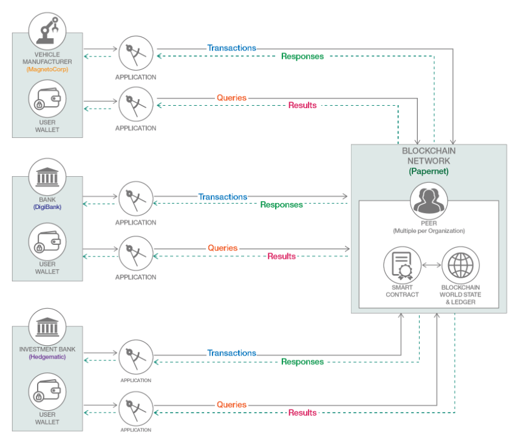
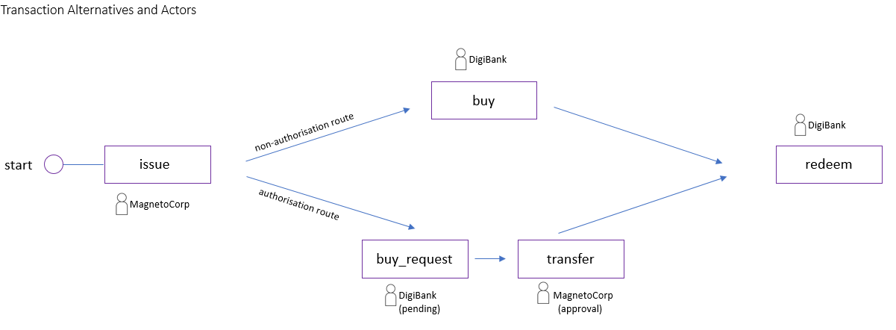

<a name="top"></a>

# Commercial Paper Tutorial & Samples

## Introduction

This folder contains a structured set of smart contracts and application clients (ie. in a choice of languages, eg Node.js, Java, Go etc) relating to *Commercial Paper*, a finance 'instrument' (in Global Finance). At present, the Node.js sample contract in particular has further added functionality: an optional two-step authority check (see diagram below), when redeeming a commercial paper instance - and a range of sample ledger queries, to help consolidate your learning; both can be explored using the Node.js application client.

While a more detailed 'explainer' of the Commercial Paper scenario (including use case analysis, code walkthrough & practices, logical/physical representation of ledger data etc) can be found in the [Hyperledger Fabric Commercial Paper Tutorial](https://hyperledger-fabric.readthedocs.io/en/latest/tutorial/commercial_paper.html), you don't have to read through this, just to try out this sample. There's also a [Wikipedia page](https://en.wikipedia.org/wiki/Commercial_paper)

<details><summary>Key Objectives </summary>

  * see a Commercial Paper use case in action

  * explore the key 'takeaways': understand differences between asset _state_ changes ('e.g. 'lifecycle') and transaction _inputs_* (e.g. 'inputs' during lifecycle)

  * try out a number of different query types: asset history, asset state, ownership, partial key, named query (criteria-based), ad-hoc queries (you supply a query string) - presently available in the Node.js sample only.

    \* the smart contract uses these (along with business logic) to decide outcomes; some inputs change the asset _state_ (like 'ownership') ; some don't.

</p>
</details>

<details><summary>Blockchain: benefits to Commercial Paper marketplaces?</summary>

  * replace long-winded, time consuming processing between multiple organisations - the network makes it one centralized hub and helps simplify workflow.

  * full transparency, traceability and ownership of issued papers

  * speed up a process that can take days - e. make same-day issuance a reality, or even a market paradigm.

  * in asset-backed commercial paper markets, blockchain can help increase accessibility (to a marketplace) to SMEs to partake in issuance, where otherwise it was inaccessible.

  * integration to other areas, like supply chain finance

 </p>
 </details>


 Expand the twisty below to see an overview diagram of a 'sample' Commercial paper marketplace - transactions, queries being executed by different organisations (we'll focus on two of these organisations)

<details><summary>PaperNet Overview diagram - The sample commercial paper marketplace</summary>



</p>
</details>

But first, it might useful to explain Commercial Paper, an unsecured promissory note issued to obtain capital, and operates in global financial markets. A Commercial Paper instance is represented as an asset with a lifecycle, recorded on the blockchain - transactions change its _state_ (over time) and those transactions, naturally - have _inputs_.


#### Explainers

<details><summary>Commercial Paper - what is it briefly?</summary>

</br>
It is a type of unsecured promissory note, issued by established companies (eg big manufacturers, blue chip corporations) to gain short-term capital - usually no more than 6-9 months. Why? To meet short-term financial obligations. Commercial paper is generally purchased by money market funds and banks - in fact, it becomes a more important investment strategy during financial recessions :-) . A corporation issues a paper (in the form of a promissory note) for specific projects, such as big capital investments, to pay contractors or even to exercise debt restructuring. The tutorial describes MagnetoCorp (car manufacturer) who have landed a huge contract, and will need approx. $5m in capital (payroll obligations), to hire 1000 car workers for at least 6 months (with no car revenues yet - its a financial strain). Underpinning this, of course, is that MagnetoCorp, has every confidence that (say, in 6 months time) it will be in a position to pay out the face value ($5m in this case) when the commercial paper is redeemd by an owner of the paper, upon maturity :-).
</p>
</details>

<details><summary>Ins and Outs, Attractions of Commercial Paper Investment?</summary>

</br>
Investors (who buy Commercial Paper) are attracted as they agree to buy them at a discount (say $4.94m) on the face value (eg $5m) and moreso, they obtain a higher yield than if they were simply gaining interest in a bank (eg. 2% interest on $4.95m today = $5m in 6 months time). But there is a 'premium' attached, with carrying the risk of a debt/loan that is essentially unsecured (unlike a bank) - which is where credit risk and ratings comes in. As a result, the actual yield from the investment chosen is in effect $10k greater (than pure interest, in the example given).
</p>
Once an issuing corporation becomes established in the commercial paper marketplace, it builds a high credit rating (risk affects how much of a premium investors seek and therefore discount accordingly) - in fact, it is often cheaper (for a blue chip company) to draw on a commercial paper than on a bank line of credit. But that rating reflects the issuer's ability to pay back on maturity.
</p>
I mentioned marketplace: even during the typical 6-9 month period, a commercial paper can be bought and sold multiple times (its quoted, at the discounted price on money markets), before the Commercial Paper reaches its maturity date. On that date, the current investor (or owner) 'redeems' the paper bond with MagnetoCorp, the issuer and gets the face value of $5m.

</details>

<sup>[_back to top_](#top)</sup>

## Scenario Overview


In this tutorial two organizations, MagnetoCorp and DigiBank, trade commercial paper with each other on 'PaperNet', the marketplace represented by a Hyperledger Fabric blockchain network. Note that there are two alternative transaction flows - one which mirrors the [Commercial Paper Tutorial](https://hyperledger-fabric.readthedocs.io/en/latest/tutorial/commercial_paper.html) as described in Fabric documentation, and one which requires the authorised owner of the paper to complete a transfer following a request to buy the commercial paper - the latter example features an authorization check in the smart contract that ensures the transactor is from the organization that currently owns the commercial paper - they approve and complete the buy request. These are the commercial paper transaction lifecycles you can try out:



The tutorial exercises the commercial paper asset lifecycle: _issue_, _buy_ ( 1 to _n_ ) (or _buy_request_ / _transfer_ alternative), and _redeem_ transactions: the key 'takeaways' from the scenario are:

- understanding the  _changes in state_ in the commercial paper asset (reflected in the ledger world state) which reaches maturity after 6 months.
- understanding the _transaction inputs_  for each transaction (some inputs change the asset  _state_ - eg. ownership) and some _don't_  (e.g. purchase price) and not part of the asset - but importantly, the _inputs_ for a given transaction are recorded on the blockchain).
- understanding the importance of _queries_  such as: asset history, rich queries (criteria matching etc), transaction history (where the inputs are recorded)

Client applications (CLI based) are used:

- to perform the transactions
- run queries (Node.js sample only)
- examine the transaction inputs (as opposed to _states_) that are written to the ledger after you perform a transaction (using the Node.js listener).

This sample uses the `test-network` . You’ll act as Isabella, an employee of MagnetoCorp (Org2), who will issue a commercial paper on its behalf. You’ll then 'switch hats' to take the role of Balaji, an employee of DigiBank (Org1), who will buy this commercial paper, hold it for a period of time, and then redeem it with MagnetoCorp for a small profit or yield. Note that the smart contract sample doesn't enforce the actual hold period ; the user can, in fact, redeem the paper immediately.


## Quick Start

Below are the quick start instructions for running the tutorial. As mentioned, if you're interested in a 'deeper dive' analysis and importance of the concepts, design, structure and implementation  of the smart contract,  they can be found in the [Hyperledger Fabric Commercial Paper Tutorial](https://hyperledger-fabric.readthedocs.io/en/latest/tutorial/commercial_paper.html). Suffice to say, you DON'T have to have read this, to do this tutorial.

This `README.md` file is in the `commercial-paper` directory, the source code for client applications and the contracts is in the `organization` directory.

### High-Level Overview of Steps

1) Install Binaries, Start the Hyperledger Fabric infrastructure

   The Fabric 'test-network' will be used - this has two organizations 'Org1' and 'Org2'  DigiBank will be Org1, and MagnetoCorp will be Org2.

2) Install and Instantiate the Contracts

3) Run client applications in the roles of MagnetoCorp and DigiBank to trade the commercial paper

   - Issue the Paper as Magnetocorp (org2)
   - Buy the paper as DigiBank (org1)
   - Redeem the paper as DigiBank (org1)

   See also the transaction flow and alternatives in the Scenario Overview below.

<sup>[_back to top_](#top)</sup>

## Setup

You will need a machine with the following

- Docker and docker-compose installed
- Node.js v12 if you want to run JavaScript client applications
- Java v8 if you want to run Java client applications
- Maven to build the Java applications

You will need to install the `peer` cli binaries and cloned the `fabric-samples` repository. For more information see
[Install the Samples, Binaries and Docker Images](https://hyperledger-fabric.readthedocs.io/en/latest/install.html) in the Hyperledger Fabric documentation. Once you have installed the cli binaries, ensure you have added the  `bin` directory (for your `peer` commands used by scripts below) to your exported `PATH` variable in your `.bashrc` or `.profile` directory (per below). This is important as you will be opening a number of windows which will need PATH set. Finally, check that it finds the `peer` command in your PATH using the `which` command  eg.

```
export PATH=<path_to_bin_directory>:$PATH
which peer
```


It is advised to have 3 terminal windows (consoles) open;

* one to monitor the infrastructure
* one for MagnetoCorp
* one for DigiBank.

Once you've cloned the `fabric-samples` - change to the `commercial-paper` directory in each window.

```
git clone https://github.com/hyperledger/fabric-samples.git
```

```
cd fabric-samples/commercial-paper
```

## Running the Infrastructure

In one console window, run the network starter script - this will start the two organization `test-network` blockchain network.

```
./network-starter.sh
```

You can re-use this console window if you wish, but it is recommended to run a docker container monitoring script in its own window. This will let you view what Fabric is doing and help diagnose any failures.

```bash
./organization/magnetocorp/configuration/cli/monitordocker.sh fabric_test
```

### Setup the Organizations' environments

The contract code is available as either JavaScript, Java or Go. You can use either one, and the choice of contract language does not affect the choice of client language. With the v2.0 Fabric chaincode lifecycle, this requires operations for both MagnetoCorp and Digibank admin.  Open two windows in the fabric-samples/commercial paper directory, one for each organization.

In your 'MagnetoCorp' window run the following commands, to set the shell environment variables needed to act as that organization. The leading '.' in the command sequence sets in your current environment - if you do not run this, you will not be able to package the chaincode.

```
cd fabric-samples/commercial-paper/organization/magnetocorp
. ./magnetocorp.sh
```

You can either copy and paste them directly into the terminal, or invoke directly in your own command shell. For example if you are using bash or zsh on Linux you can use this command.

```
source <(./magnetocorp.sh)
```

Similarly in your 'DigiBank' window run the following commands as shown:

```
cd fabric-samples/commercial-paper/organization/digibank
. ./digibank.sh
```

<sup>[_back to top_](#top)</sup>


### Deploy the smart contract to the channel

You need to perform similar operations for _both_ organizations and for your language choice from the instructions below. For the different contract languages, the steps are very similar  - the full set of steps are actually shown in the JavaScript section (see twisty). However, you will perform one or two different initial steps for Java or Go before completing the remaining common steps as instructed in those language sections.

Note that the commands below make use of the `jq` utility for parsing output - download and install it from [the jq download page](https://stedolan.github.io/jq/download/).


**<details><summary>For a JavaScript Contract</summary>**


Running in MagnetoCorp directory:

```
# MAGNETOCORP

peer lifecycle chaincode package cp.tar.gz --lang node --path ./contract --label cp_0
peer lifecycle chaincode install cp.tar.gz

export PACKAGE_ID=$(peer lifecycle chaincode queryinstalled --output json | jq -r '.installed_chaincodes[0].package_id')
echo $PACKAGE_ID              # FYI may look like this:      'cp_0:nnnxxxxxxxxxxxxxxxxxxxxxxxxxxxxxx'
```

```

peer lifecycle chaincode approveformyorg  --orderer localhost:7050 --ordererTLSHostnameOverride orderer.example.com \
                                          --channelID mychannel  \
                                          --name papercontract  \
                                          -v 0  \
                                          --package-id $PACKAGE_ID \
                                          --sequence 1  \
                                          --tls  \
                                          --cafile "$ORDERER_CA"

peer lifecycle chaincode checkcommitreadiness --channelID mychannel --name papercontract -v 0 --sequence 1
```

Running in Digibank directory:

```

# DIGIBANK

peer lifecycle chaincode package cp.tar.gz --lang node --path ./contract --label cp_0
peer lifecycle chaincode install cp.tar.gz

export PACKAGE_ID=$(peer lifecycle chaincode queryinstalled --output json | jq -r '.installed_chaincodes[0].package_id')
echo $PACKAGE_ID

peer lifecycle chaincode approveformyorg  --orderer localhost:7050 --ordererTLSHostnameOverride orderer.example.com \
                                          --channelID mychannel  \
                                          --name papercontract  \
                                          -v 0  \
                                          --package-id $PACKAGE_ID \
                                          --sequence 1  \
                                          --tls  \
                                          --cafile "$ORDERER_CA"

peer lifecycle chaincode checkcommitreadiness --channelID mychannel --name papercontract -v 0 --sequence 1

```

Once both organizations have installed, and approved the chaincode, it can be committed.

```
# MAGNETOCORP

peer lifecycle chaincode commit -o localhost:7050 \
                                --peerAddresses localhost:7051 --tlsRootCertFiles "${PEER0_ORG1_CA}" \
                                --peerAddresses localhost:9051 --tlsRootCertFiles "${PEER0_ORG2_CA}" \
                                --ordererTLSHostnameOverride orderer.example.com \
                                --channelID mychannel --name papercontract -v 0 \
                                --sequence 1 \
                                --tls --cafile "$ORDERER_CA" --waitForEvent

```

To test, try sending some simple transactions.

```

peer chaincode invoke -o localhost:7050  --ordererTLSHostnameOverride orderer.example.com \
                                --peerAddresses localhost:7051 --tlsRootCertFiles "${PEER0_ORG1_CA}" \
                                --peerAddresses localhost:9051 --tlsRootCertFiles "${PEER0_ORG2_CA}" \
                                --channelID mychannel --name papercontract \
                                -c '{"Args":["org.papernet.commercialpaper:instantiate"]}' ${PEER_ADDRESS_ORG1} ${PEER_ADDRESS_ORG2} \
                                --tls --cafile "$ORDERER_CA" --waitForEvent

peer chaincode query -o localhost:7050  --ordererTLSHostnameOverride orderer.example.com \
                                        --channelID mychannel \
                                        --name papercontract \
                                        -c '{"Args":["org.hyperledger.fabric:GetMetadata"]}' \
                                        --peerAddresses localhost:9051 --tlsRootCertFiles "${PEER0_ORG2_CA}" \
                                        --tls --cafile "$ORDERER_CA" | jq '.' -C | more
```
</p>
</details>


**<details><summary>For a Java Contract:</summary>**


Before the `peer lifecycle chaincode package` command below, you will first need to change into each organization's `contract-java` directory and issue

```
./gradlew build
```

Then complete the steps below.


Running in MagnetoCorp contract directory:

```
# MAGNETOCORP

peer lifecycle chaincode package cp.tar.gz --lang java --path ./contract-java --label cp_0
peer lifecycle chaincode install cp.tar.gz

export PACKAGE_ID=$(peer lifecycle chaincode queryinstalled --output json | jq -r '.installed_chaincodes[0].package_id')
echo $PACKAGE_ID              # FYI may look like this:      'cp_0:nnnxxxxxxxxxxxxxxxxxxxxxxxxxxxxxx'
```

```

peer lifecycle chaincode approveformyorg  --orderer localhost:7050 --ordererTLSHostnameOverride orderer.example.com \
                                          --channelID mychannel  \
                                          --name papercontract  \
                                          -v 0  \
                                          --package-id $PACKAGE_ID \
                                          --sequence 1  \
                                          --tls  \
                                          --cafile "$ORDERER_CA"

peer lifecycle chaincode checkcommitreadiness --channelID mychannel --name papercontract -v 0 --sequence 1
```

Running in Digibank

```

# DIGIBANK

peer lifecycle chaincode package cp.tar.gz --lang java --path ./contract-java --label cp_0
peer lifecycle chaincode install cp.tar.gz

export PACKAGE_ID=$(peer lifecycle chaincode queryinstalled --output json | jq -r '.installed_chaincodes[0].package_id')
echo $PACKAGE_ID

peer lifecycle chaincode approveformyorg  --orderer localhost:7050 --ordererTLSHostnameOverride orderer.example.com \
                                          --channelID mychannel  \
                                          --name papercontract  \
                                          -v 0  \
                                          --package-id $PACKAGE_ID \
                                          --sequence 1  \
                                          --tls  \
                                          --cafile "$ORDERER_CA"

peer lifecycle chaincode checkcommitreadiness --channelID mychannel --name papercontract -v 0 --sequence 1

```

Once both organizations have installed, and approved the chaincode, it can be committed.

```
# MAGNETOCORP

peer lifecycle chaincode commit -o localhost:7050 \
                                --peerAddresses localhost:7051 --tlsRootCertFiles "${PEER0_ORG1_CA}" \
                                --peerAddresses localhost:9051 --tlsRootCertFiles "${PEER0_ORG2_CA}" \
                                --ordererTLSHostnameOverride orderer.example.com \
                                --channelID mychannel --name papercontract -v 0 \
                                --sequence 1 \
                                --tls --cafile "$ORDERER_CA" --waitForEvent

```

To test, try sending some simple transactions.

```

peer chaincode invoke -o localhost:7050  --ordererTLSHostnameOverride orderer.example.com \
                                --peerAddresses localhost:7051 --tlsRootCertFiles "${PEER0_ORG1_CA}" \
                                --peerAddresses localhost:9051 --tlsRootCertFiles "${PEER0_ORG2_CA}" \
                                --channelID mychannel --name papercontract \
                                -c '{"Args":["org.papernet.commercialpaper:instantiate"]}' ${PEER_ADDRESS_ORG1} ${PEER_ADDRESS_ORG2} \
                                --tls --cafile "$ORDERER_CA" --waitForEvent

peer chaincode query -o localhost:7050  --ordererTLSHostnameOverride orderer.example.com \
                                        --channelID mychannel \
                                        --name papercontract \
                                        -c '{"Args":["org.hyperledger.fabric:GetMetadata"]}' \
                                        --peerAddresses localhost:9051 --tlsRootCertFiles "${PEER0_ORG2_CA}" \
                                        --tls --cafile "$ORDERER_CA" | jq '.' -C | more
```

</p>
</details>

**<details><summary>For a Go Contract</summary>**


Before the `peer lifecycle chaincode package` command step, you will need to change into <ins>each</ins> organization's `contract-go` directory and issue

```
go mod vendor
```

Then complete the steps below.


Running in MagnetoCorp contract directory:

```
# MAGNETOCORP

peer lifecycle chaincode package cp.tar.gz --lang golang --path ./contract-go --label cp_0
peer lifecycle chaincode install cp.tar.gz

export PACKAGE_ID=$(peer lifecycle chaincode queryinstalled --output json | jq -r '.installed_chaincodes[0].package_id')
echo $PACKAGE_ID              # FYI may look like this:      'cp_0:nnnxxxxxxxxxxxxxxxxxxxxxxxxxxxxxx'
```

```

peer lifecycle chaincode approveformyorg  --orderer localhost:7050 --ordererTLSHostnameOverride orderer.example.com \
                                          --channelID mychannel  \
                                          --name papercontract  \
                                          -v 0  \
                                          --package-id $PACKAGE_ID \
                                          --sequence 1  \
                                          --tls  \
                                          --cafile "$ORDERER_CA"

peer lifecycle chaincode checkcommitreadiness --channelID mychannel --name papercontract -v 0 --sequence 1
```

Running in Digibank

```

# DIGIBANK

peer lifecycle chaincode package cp.tar.gz --lang golang --path ./contract-go --label cp_0
peer lifecycle chaincode install cp.tar.gz

export PACKAGE_ID=$(peer lifecycle chaincode queryinstalled --output json | jq -r '.installed_chaincodes[0].package_id')
echo $PACKAGE_ID

peer lifecycle chaincode approveformyorg  --orderer localhost:7050 --ordererTLSHostnameOverride orderer.example.com \
                                          --channelID mychannel  \
                                          --name papercontract  \
                                          -v 0  \
                                          --package-id $PACKAGE_ID \
                                          --sequence 1  \
                                          --tls  \
                                          --cafile "$ORDERER_CA"

peer lifecycle chaincode checkcommitreadiness --channelID mychannel --name papercontract -v 0 --sequence 1

```

Once both organizations have installed, and approved the chaincode, it can be committed.

```
# MAGNETOCORP

peer lifecycle chaincode commit -o localhost:7050 \
                                --peerAddresses localhost:7051 --tlsRootCertFiles "${PEER0_ORG1_CA}" \
                                --peerAddresses localhost:9051 --tlsRootCertFiles "${PEER0_ORG2_CA}" \
                                --ordererTLSHostnameOverride orderer.example.com \
                                --channelID mychannel --name papercontract -v 0 \
                                --sequence 1 \
                                --tls --cafile "$ORDERER_CA" --waitForEvent

```

To test, try sending some simple transactions.

```

peer chaincode invoke -o localhost:7050  --ordererTLSHostnameOverride orderer.example.com \
                                --peerAddresses localhost:7051 --tlsRootCertFiles "${PEER0_ORG1_CA}" \
                                --peerAddresses localhost:9051 --tlsRootCertFiles "${PEER0_ORG2_CA}" \
                                --channelID mychannel --name papercontract \
                                -c '{"Args":["org.papernet.commercialpaper:instantiate"]}' ${PEER_ADDRESS_ORG1} ${PEER_ADDRESS_ORG2} \
                                --tls --cafile "$ORDERER_CA" --waitForEvent

peer chaincode query -o localhost:7050  --ordererTLSHostnameOverride orderer.example.com \
                                        --channelID mychannel \
                                        --name papercontract \
                                        -c '{"Args":["org.hyperledger.fabric:GetMetadata"]}' \
                                        --peerAddresses localhost:9051 --tlsRootCertFiles "${PEER0_ORG2_CA}" \
                                        --tls --cafile "$ORDERER_CA" | jq '.' -C | more
```


</p>
</details>


<sup>[_back to top_](#top)</sup>


## Client Applications

Note for Java applications, you will need to compile the Java Code using `maven`. Use this command in each application-java directory

```
mvn clean package
```

Note for JavaScript applications, you will need to install the dependencies first. Use this command in each application directory

```
npm install
```
>  Note that there is NO dependency between the language of any one client application and any contract. Mix and match as you wish!

The docker containers don't contain the node or Java runtimes; so it is best to exit the docker containers - but keep the windows open and run the applications locally.

As mentioned earlier in the Sample introduction section, transaction _inputs_ are recorded on the ledger, as well as any asset _state_ changes. Just *before* you run the _issue_ application script below - you need to launch a block 'listener' application that will show you these _inputs_, as you complete each transaction in the commercial paper lifecycle (eg. Paper Number: 00001, 00002 etc) .

For the listener, its best to open a *new* terminal for this in the `commercial-paper/organization/magnetocorp/application` directory (javascript). Next, run the `addToWallet` step in the `issue` transaction below, to add Isabella's identity to the wallet - the listener will use this wallet. Once the listener is launched, it will show the inputs for transactions you will perform and which are committed to blocks (ie part of the ledger).  Note: initially, the listener may show a spurious message, and then go into a _listening_ or 'wait' state. As transactions complete below, messages will be displayed by the listener - so keep an eye out. *After* adding Isabella's wallet, you can then launch the listener as follows:

```
node cpListener.js
```

**<details><summary>Issue the commercial paper</summary>**

The paper is issued by *MagnetoCorp*

You can now run the applications to issue the commercial paper. Change to either the
`commercial-paper/organization/magnetocorp/application` directory (javascript) or  `commercial-paper/organization/magnetocorp/application-java` directory (java)

*Add the Identity to be used to the wallet*

```
node addToWallet.js
# or
java -cp target/commercial-paper-0.0.1-SNAPSHOT.jar org.magnetocorp.AddToWallet
```

*Issue the Commercial Paper*

```
node issue.js
# or
java -cp target/commercial-paper-0.0.1-SNAPSHOT.jar org.magnetocorp.Issue
```

Don't forget to check the application listener for messages above!

</p>
</details>


**<details><summary>Buy the commercial paper</summary>**

_Buy_ is performed as *Digibank*;

You can now run the applications to buy the paper. Change to either the
`commercial-paper/organization/digibank/application` directory or  `commercial-paper/organization/digibank/application-java`

*Add the Identity to be used*

```
node addToWallet.js
# or
java -cp target/commercial-paper-0.0.1-SNAPSHOT.jar org.digibank.AddToWallet
```

*Buy the paper*

```
node buy.js
# or
java -cp target/commercial-paper-0.0.1-SNAPSHOT.jar org.digibank.Buy
```

If you have just executed a `buy` transaction above - jump to the `redeem` transaction below - otherwise execute the _buy_/_transfer_ sequence as described earlier.

*Alternative: Request to Buy the paper (buy/transfer)*

```
node buy_request.js
```

Now complete the _request_ by switching to the `MagnetoCorp` application directory (javascript) and execute a `transfer` transaction as MagnetoCorp:

```
cd ../../magnetocorp/application

node transfer.js
```

</p>
</details>

**<details><summary>Redeem the commercial paper</summary>**

_Redeem_ is performed as *Digibank*  - the current owner (buyer) in the lifecycle.

You can now run the applications to redeem the paper. Change to either the
`commercial-paper/organization/digibank/application` directory or  `commercial-paper/organization/digibank/application-java`


*Redeem*

```
node redeem.js
# or
java -cp target/commercial-paper-0.0.1-SNAPSHOT.jar org.digibank.Redeem
```

</p>
</details>


**<details><summary>Perform Queries: Ownership, Asset History etc (Node.js sample only) </summary>**

 Having completed the full commercial paper lifecycle for one paper (paper number: 00001) some queries below won't show a lot of data - as an optional exercise, you can change the scripts above (paper number: 00002) to create another paper lifecycle and run the `queryapp` application below (change query 1 to the new CP number FYI), with more data available. As indicated, the query transactions mentioned are presently only available in the Node.js sample.

 Execute the Node.js application client script, which will run the following 5 queries, in order:

  - History of Commercial Paper (Note: the paper state is shown more descriptively eg.  'ISSUED', 'TRADING' and based on currentState values on ledger)
  - Ownership of Commercial Papers
  - Partial Key query, for Commercial papers in org.papernet.papers namespace belonging to MagnetoCorp
  - Named Query: all redeemed papers in a state of 'redeemed' (currentState = 4)
  - Named Query: all commercial papers with a face value > $4m

  From the `digibank/application` subdirectory run:

  ```
  node queryapp.js
  ```

 </p>
</details>

When you're done with this section, return to the terminal where your Node.js _listener_ application is running, and terminate the process.

## Clean up
When you are finished using the Fabric test network and the commercial paper smart contract and applications, you can use the following command to clean up the network:

```
./network-clean.sh
```

<sup>[_back to top_](#top)</sup>
