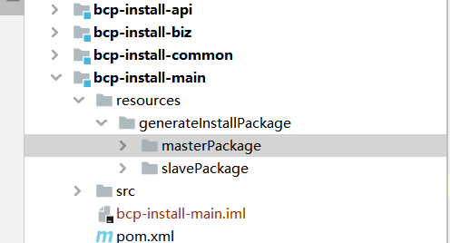
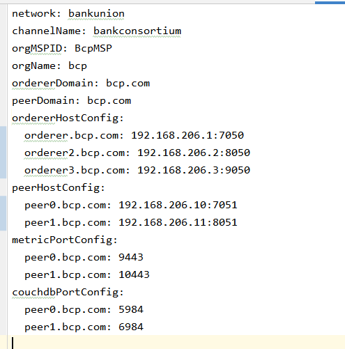
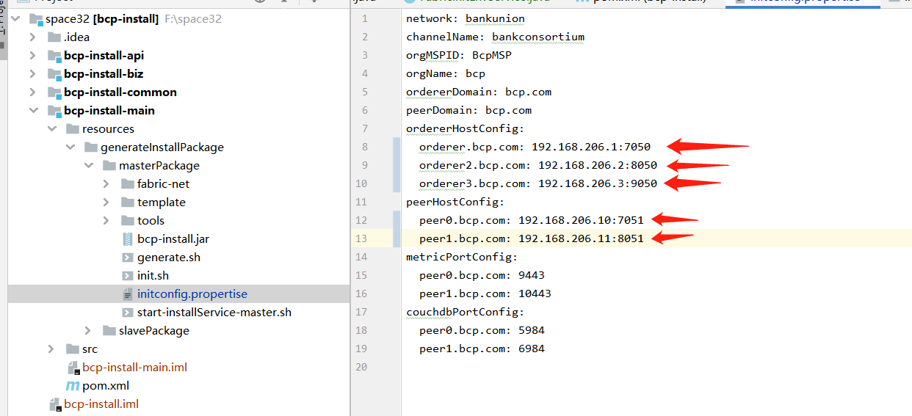
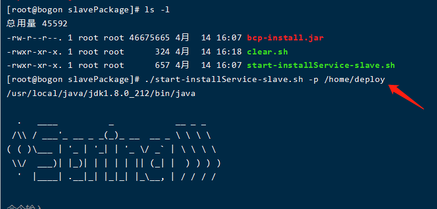
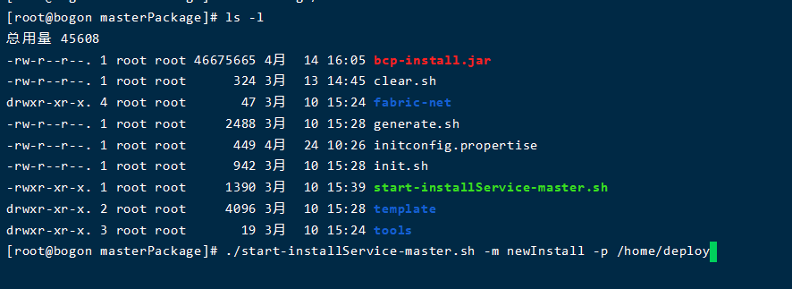

# Introduction

This project is aimed to automate the deployment process of the hyperledger fabric. Hyperledger Fabric is a platform for distributed ledger solutions and the examples released can easily deploy the Hyperledger Fabric network in a standalone machine environment, including order, peer chaincode and so on.

However, If you want to build up the Hyperledger Fabric network in the distributing development environments, it is not a easy task and you have to deploy the modules in each of the machine manually, which is including lots of configurations and commands and inconvenient. Our preject is a tool to help you to install the hyperledger fabric in the distributing development environments easily and conveniently.

The deployment tool provides basic mechanisms for deployment, repairment, and scaling of applications. Firstly, once you have completed the configuration of the orderer and peer，witch include the information of the role,the domain and ip address， the tool can deploy the orderer and the peer according the configuration you written by itself. Secondly, when the hyperledger fabric network is running， the tool can scale your hyperledger fabric network up and down with a simple command.

## Prerequisites

The tool run at the Linux OS and make sure the requirements as follow:

- jDK1.8 or above
- Maven
- Docker
- Docker-compose
- Fabric 1.4.2

## How to build

You can build the tool for your machine by executing the following commands:

```shell
cd fabric-samples/distributed-deploy/
mvn package -DskipTests
```

After that the jar is built in the *bcp-install-main/target* and you enter the root of the fabric and run the command make release， and you need to copy the **configtxgen**, **configtxlator** and **cryptogen** to the directory of the path as follow:

*bcp-install-main/resources/generateInstallPackage/masterPackage/tools/linux*

## How to use

### Install the intall.jar

In this section， we will show how to use our tool to deploy the hyperledger fabric network includding two peers named `peer0` and `peer1` and three orderers named `orderer0`， `orderer2`， `orderer3` in the distributing development environments.

After you have built the bcp-install.jar in your project, now you need to copy the jar to the directory named masterPackage and slavePackage, they are both under the **generateInstallPackage** as the picture1 show. You should notice that you also need to upload the masterPackage and slavePackage to the machines, the masterPackage should be uploaded to master node and slavePackage should be the slave one.



Then we will show you how to deploy the the hyperledger fabric network, in the presentation below, we have two peer nodes named `peer0` and `peer1`, and we have three orderer nodes named `oderder0`, `orderer1`, `orderer2`, and we choose `peer0` as master node and the others are the slave ones.

### About the initconfig.propertise

In this section, you will learn about the configuration of the file initconfig.propertise. The file initconfig.propertise is located in the directory masterPackage and is important to the tool for the deployment, since it contains the information about fabric network such as info of the organization in the hyperledger， the channel info such as the chanelName and the information of orderer node and the peer node and so on. The description about the attribution in initconfig.propertise is shown in the table below and in this example, our initconfig.propertise is also shown below.

| Attribution  | Description  |
| ------------ | ------------ |
| network  | the name of the fabric network  |
| channelName  | the name of the channel name  |
| orgMSPID  | the MSPID of the organization  |
| orgName  | the name of the organization  |
| OrdererDomain  | the domain of the orderer  |
| PeerDomain  | the domain of the peer  |
| ordererHostConfig  | the host of the order node  |
| peerHostConfig  | the host of the peer node  |
| metricPortConfig  | the port which the peer use to transaction  |
| couchDBPortConfig  | the couchdb port  |

*Table  description of the attribution about the initconfig.propertise*



### Config your initconfig.properties

The initconfig.properties in the masterPackage offer the info of all the hyperledger fabric network you want to build， and you need to config the information of your network in it， such as the ip and port of the node. In the example， just as the picture2 show below， you can see that we set all of the ip and port of the nodes of fabric network includding `peer0`、`peer1`、`orderer0`、`orderer1` and `orderer2`.



### Intall your hyperledger fabric

When you come to this step， you can run the script to deploy your network. In previous step， you have uploaded the slavePackage to every slave machine， and under the directory， there is a script named start-installService-slave.sh. Now you need to run the scrip named start-installService-slave.sh in the slavePackage directory in each of the slave machine with the command below, the parameter of p should follow the absolute path the fabric network you want to deploy.In this example, we choose /home/deploy as our deployment path.

```shell
./start-installService-slave.sh -p /path/to/deloy
```



After completed the deployment in the slave machine， you need to deploy the master machine. Remember that in this example， we choose the peer0 as our master machine and we upload the masterPackage in it and now we need to run the script start-installService-master.sh with the command below. The parameter m is symbol for the pattern you want to deploy your network， you have two choices， the newInstall and updateNetwork， which newInstall means you are the first time to install the fabric network and the updateNetwork means you want to update the network. The parameter p is just as the start-installService-slave.sh above，should be follow the absolute path the fabric network you want to deploy. In this example， we run the command:

```shell
./start-installService-slave.sh -m newInstall/updateNetwork -p /path/to/deloy
```



## Scale up/down your hyperledger fabric

In this section， you will learn how to scale up the hyperledger fabric network using our tool.

When you want to scale up or down your fabric network， you need to config the config properties initconfig.propertise. For example， if you want to scale up your network， you should add the node info such as the domain， ip and port and so on into the peerHostConfig section or ordererHostConfig section，according to which one you want to add. When you want to scale down the network， you need to delete the node info in the peerHostConfig section or ordererHostConfig section， according to which one you want to delete.

After you have completed the modification about the initconfig.propertise， you can startup your peer node or orderer node.

When you want to add a new peer in your fabric network， firstly， you should run the start-installService-master.sh in the master machine， in this example， we execute the command below， you need to pay attention to the path follow the parameter p， which need to be the same as the path as you intall the network in the master machine.

```shell
./start-installService-master.sh -m updateNetwork -p /home/bcp-master
```

After that， you need to run the script start-installService-slave.sh in the slave machine， it is keypoint that you should only run the script on the machine you want to add to the network not all the salve machine. And in this example, we run the command below in the slave machine:

```shell
./start-installService-slave.sh -p /home/deploy
```

When you want to add a new orderer in your fabric network， one thing you should notice is the addition of the orderer node will be influence the fabric network and there will be a little difference from the steps when you add a peer node. Firstly， you should run the start-installService-master.sh in the master machine， in this example， we execute the command below， you need to pay attention to the path follow the parameter p， just as the mention above, which need to be the same as the path as you install the network in the master machine:

```shell
./start-installService-master.sh -m updateNetwork -p /home/bcp-master
```

After that， you need to run the script start-installService-slave.sh in the slave machine， it is key-point that you should not only run the script on the machine you want to add to the network but also all the salve machines you have intall the orderer node. And in this example, we run the command below in the slave machine:

```shell
./start-installService-slave.sh -p /home/deploy
```

## Attribution

Thank you for considering to help out with the source code! We welcome contributions from anyone on the internet, and are grateful for even the smallest of fixes!

If you'd like to contribute to the project, please fork, fix, commit and send a pull request for the maintainers to review and merge into the main code base.

## License

The source code of our project are made available under the Apache License, Version 2.0 (Apache-2.0), located in the LICENSE file. ** Project documentation files are made available under the Creative Commons Attribution 4.0 International License (CC-BY-4.0), available at http://creativecommons.org/licenses/by/4.0/.
