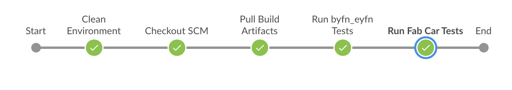

# Continuous Integration Process

This document explains the fabric-samples Jenkins pipeline flow and FAQ's on the build
process to help developer to get more familiarize with the process flow.

We use Jenkins as a CI tool and to manage jobs, we use [JJB](https://docs.openstack.org/infra/jenkins-job-builder).
Please see the pipeline job configuration template here https://ci-docs.readthedocs.io/en/latest/source/pipeline_jobs.html#job-templates.

## CI Pipeline flow

- Every Gerrit patchset triggers a verify job with the Gerrit Refspec on the parent commit
  of the patchset and runs the below tests from the `Jenkinsfile`. Note: when you are ready
  to merge the patchset, it's always a best practice to rebase the patchset on the latest commit.

All the below tests runs on the Hyperledger infrastructure x86_64 build nodes. All these nodes
uses the packer with pre-configured software packages. This helps us to run the tests in much
faster than installing required packages everytime.

Below steps shows what each stage does in the Jenkins pipeline verify and merge flow.
Before execute the below tests, it clean the environment (Deletes the left over build artifacts)
and clone the repository with the Gerrit Refspec.

Based on the value provided to **IMAGE_SOURCE** in ci.properties file, Jenkinsfile execute the
steps. If the IMAGE_SOURCE is set to "build", Jenkins clones the latest commits of fabric
and fabric-ca and builds the docker images and binaries. If you specify IMAGE_SOURCE as "nexus",
it always pulls the latest fabric and fabric-ca images published from nightly job which triggers
everyday at 8:00 PM EST.

Also, it pulls the "javaenv" and "nodeenv" images from the latest published images from nexus3.
NOTE: nodeenv image is available only in master branch.

Once the artifacts stage is ready, Jenkins executes the below tests

- byfn & eyfn tests
   - on default channel
   - Custom channel with couchdb
   - on node chaincode

- fabcar tests
   - go
   - javascript
   - typescript

Above pipeline flow works the same on both `fabric-samples-verify-x86_64` and `fabric-samples-merge-x86_64` pipeline jobs.

See below **FAQ's** for more information on the pipeline process.

## FAQ's

#### How to re-trigger failed tests?

You can post comments `reverify` or `reverify-x` on the gerrit patchset to trigger the `fabric-samples-verify-x86_64`
job which triggers the pipeline flow as mentioned above. Also, we provided `remerge` or `remerge-x`
comment phrases to re-trigger the failed merge job.

#### Where should I see the output of the stages?

Pipeline supports two views (stages and blueocean). **Staged views** shows on the Jenkins job
main page and it shows each stage in order and the status. For better view, we suggest you
to access BlueOcean plugin. Click on the build number and click on the **Open Blue Ocean**
link that shows the build stages in pipeline view.

#### How to add more stages to this pipeline flow?

We use scripted pipeline syntax with groovy and shell scripts. Also, we use global shared
library scripts which are placed in https://github.com/hyperledger/ci-management/tree/master/vars.
Try to leverage these common functions in your code. All you have to do is, understand the pipeline
flow of the tests and conditions, add more stages as mentioned in the existing Jenkinsfile.

#### How will I get build failure notifications?

On every merge failure, we send build failure email notifications to the submitter of the
patchset and sends the build details to the Rocket Chat **jenkins-robot** channel. Check the
result here https://chat.hyperledger.org/channel/jenkins-robot

#### What steps I have to modify when I create a new branch from master?

As the Jenkinsfile is completely parameterized, you no need to modify anything in the
Jenkinsfile but you may endup modifying **ci.properties** file with the appropriate
Base Versions, Baseimage versions etc... in the new branch. We suggest you to modify this
file immediately after you create a new branch to avoid running tests on older versions.

#### On what platforms these tests triggers?

- x86_64 (Run the above mentioned tests on verify and merge jobs)
- s390x  (Run the above mentioned tests in daily jobs)

#### Where can I see the Build Scripts.

We use global shared library scripts and Jenkinsfile along with the build file.

Global Shared Library - https://github.com/hyperledger/ci-management/tree/master/vars

Jenkinsfile           - https://github.com/hyperledger/fabric-samples/tree/master/Jenkinsfile

ci.properties         - https://github.com/hyperledger/fabric-samples/tree/master/ci.properties
(ci.properties is the only file you have to modify with the values required for the specific branch.)

Packer Scripts        - https://github.com/hyperledger/ci-management/blob/master/packer/provision/docker.sh
(Packer is a tool for automatically creating VM and container images, configuring them and
post-processing them into standard output formats. We build Hyperledger's CI images via Packer
and attach them to x86_64 build nodes. On s390x, we install manually. See the packages we
install as a pre-requisite in the CI x86 build nodes.)

#### How to reach out to CI team?

Post your questions or feedback in https://chat.hyperledger.org/channel/ci-pipeline or https://chat.hyperledger.org/channel/fabric-ci Rocket Chat channels. Also, you can create JIRA tasks or bugs in FABCI project. https://jira.hyperledger.org/projects/FABCI