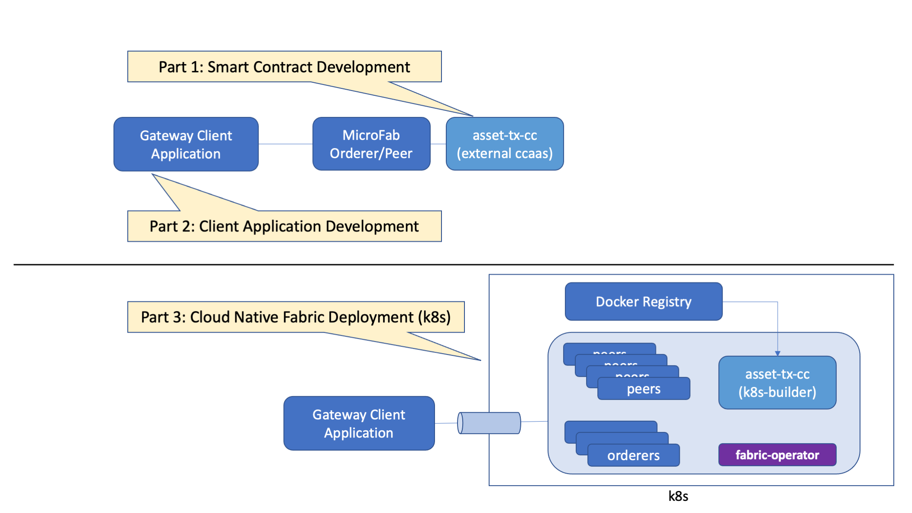

# Fabric Full Stack Development Workshop

Hyperledger Fabric can be used to represent assets of any kind on a permissioned decentralized ledger, from fungible tokens to non-fungible tokens, including monetary products, marbles, pineapples, classic cars, fine art, and anything else you can imagine.
Fabric can be used to track and update anything about these assets, common examples include asset ownership, exchange, provenance, and lifecycle.

This workshop will demonstrate how a generic asset transfer solution can be modeled and deployed to take advantage of a blockchains qualitites of service.

The workshop will be split into three sections:
- Smart Contract Development
- Client Application Development
- Cloud Native Fabric Deployment

**OBJECTIVES:**

- Show how an Asset Transfer smart contract can be written to encapsulate business logic
	- Show how the smart contract can be developed iteratively to get correct function in a development context
- Show how client applications can be written using the Gateway functionality
	- Show how the simplification of the Gateway programming model makes connecting applications more streamlined
	- Show how this streamlined approach improves resilience and availability
- Show how the solution can then be deployed to a production-class environment
	- Show how a Hyperledger Fabric network can be created and managed in Kubernetes (K8S) using automation
	- Show how the Fabric Operator and Console can be installed via Ansible playbooks
	- Show how a multi-organization configuration of Fabric can be created

---

**Please ensure you've got the [required tools](./SETUP.md) on your local machine or in a virtual machine  -- To check, run `./check.sh`**

---

## Before you begin....

Fabric is a multi-server decentralized system with orderer and peer nodes, so it can be quite complex to configure. Even the simplest smart contract needs a running Fabric Infrastructure and one size does not fit all.

There are configurations that can run Fabric either as local binaries, in a single docker container, in multiple containers, or in K8S.
This workshop will show some of the approaches that can be used for developing applications and contracts with a minimal Fabric environment (Microfab), and how a production deployment can be achieved.
There are other ways of deploying Fabric produced by the community - these are equally valid and useful. Feel free to try the others, once you understand the basic concepts to find what works best for you.

At a high-level remember that a solution using Fabric has (a) client application to send in transaction requests (b) Fabric infrastructure to service those requests (c) Smart Contract to action the transactions.
The nature of (b) the fabric infrastructure will change depending on your scenario; start simple and build up. The smart contracts and client application's code will remain the same no matter the way Fabric is provisioned.
There will be minor variations in deployment (eg local docker container vs remote K8S cluster) but fundamentally the process is the same.

## Running the workshop

 If you're running on Windows, please check the [hints and tips](./docs/tips-for-windows-dev.md)

- Ensure you've got the tools you may need, either installed locally or in a multipass virtual machine. See the [setup page](./SETUP.md) for details.
- Clone this repository to a convient location
- We suggest that you open 3 or 4 terminal windows
  - One for running chaincode in dev mode
  - One for running the fabric infrastructure and optionally one for monitoring it
  - One for client applications

- Work through the sections below in order, although you don't necessarily need to complete all the Exercises before moving to the next section.

---
## Scenario

Lets assume the assets you are tracking on the blockchain ledger are trading cards. Each trading card represents a comic book character and has an id, size, favorite color, and owner.
These trading cards can be passed between people, with some cards having more 'value' due to rarity or having notable attributes.

In token terms, think of these cards as non-fungible tokens. Each card has different attributes and individual cards can't be subdivided.

We'll create a digital representation of these cards on the blockchain ledger. There are a few important aspects of this solution to consider:

- Ledger - The blockchain ledger on each peer maintains the current state of each card (asset), as well as the history of transactions that led to the current state, so that there is no doubt about the assets issuance, provenance, attributes, and ownership.
- Asset transfer smart contract - manage changes to asset state such as the transfer of cards between people
- Organizations - Since this is a permissioned blockchain we'll model the participants as organizations that are authorized to run nodes or transact on the Fabric network. Our simple network will consist of an ordering service organization and two transacting organizations.
    - Ordering service organization - runs the ordering service to ensure transactions get ordered into blocks fairly, this may be a consortium leader or regulator in the industry. Note that ordering service nodes could also be contributed from multiple organizations, this becomes especially important when running a Byzantine Fault Tolerant (BFT) ordering service.
    - Owner Organizations - Each owner organization is authorized to run peers and submit transfer transactions for the cards (assets) that they own.

## Smart Contract Development

- [Introduction](./docs/SmartContractDev/00-Introduction.md) [Español](./docs/SmartContractDev/00-Introduction-ES.md)
- **Exercise**: [Getting Started with a Smart Contract](./docs/SmartContractDev/01-Exercise-Getting-Started.md) [Español](./docs/SmartContractDev/01-Exercise-Getting-Started-ES.md)
- **Exercise**: [Adding a new transaction function](./docs/SmartContractDev/02-Exercise-Adding-tx-function.md) [Español](./docs/SmartContractDev/02-Exercise-Adding-tx-function-ES.md)
- Reference:
  - [Detailed Test and Debug](./docs/SmartContractDev/03-Test-And-Debug-Reference.md) [Español](./docs/SmartContractDev/03-Test-And-Debug-Reference-ES.md)

## Client Application Development

- [Fabric Gateway](docs/ApplicationDev/01-FabricGateway.md)
- **Exercise:** [Run the client application](docs/ApplicationDev/02-Exercise-RunApplication.md)
- [Application overview](docs/ApplicationDev/03-ApplicationOverview.md)
- **Exercise:** [Implement asset transfer](docs/ApplicationDev/04-Exercise-AssetTransfer.md)
- [Chaincode events](docs/ApplicationDev/05-ChaincodeEvents.md)
- **Exercise:** [Use chaincode events](docs/ApplicationDev/06-Exercise-ChaincodeEvents.md)

## Cloud Native Fabric

- [Cloud Ready!](docs/CloudReady/00-setup.md) [中文](docs/CloudReady/00-setup-zh.md)
- **Exercise:** [Deploy a Kubernetes Cluster](docs/CloudReady/10-kube.md) [中文](docs/CloudReady/10-kube-zh.md)
- **Exercise:** [Deploy a Fabric Network](docs/CloudReady/20-fabric.md) [中文](docs/CloudReady/20-fabric-zh.md) 
- **Exercise:** [Deploy a Smart Contract](docs/CloudReady/30-chaincode.md)[中文](docs/CloudReady/30-chaincode-zh.md) 
- **Exercise:** [Deploy a Client Application](docs/CloudReady/40-bananas.md)[中文](docs/CloudReady/40-bananas-zh.md) 

## Epilogue

- [Go Bananas](docs/CloudReady/40-bananas.md)
- [Bring it Home](docs/CloudReady/90-teardown.md)
