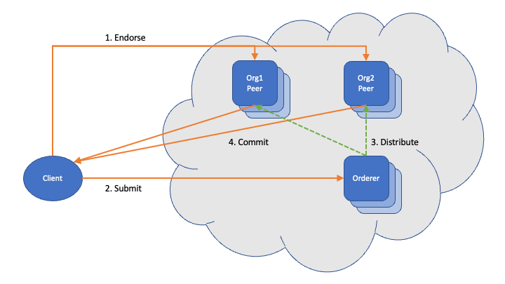
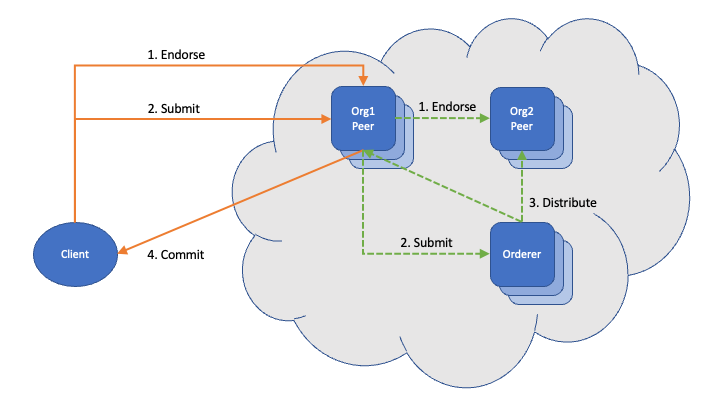
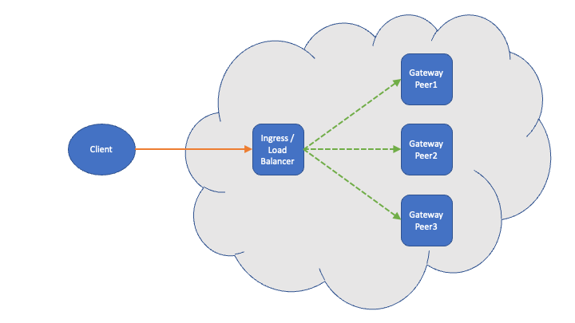

# Fabric Gateway

From Fabric v2.4 onwards, the [Fabric Gateway client API](https://hyperledger.github.io/fabric-gateway/) is the recommended API for building client applications. There are implementations in Go, Node (TypeScript / JavaScript) and Java, each providing identical capability and behavior. The client API makes use of a Fabric Gateway service embedded within Fabric v2.4+ peers. This topic describes the Fabric Gateway model and considerations for production deployment.

The concepts described here map directly to methods provided by the client API, and will help you to understand the client API behavior. Provided you have a clear understanding of the Fabric transaction flow, you can treat this topic as reference material.

## Background

To understand how Fabric Gateway works, it is necessary to understand the Fabric transaction submit (and evaluate) flow. This section provides a brief recap of the Fabric transaction flow from the perspective of the client.

### Transaction submit flow

Submit represents a ledger update. In the following diagram, solid orange lines represent interactions between the client and network nodes, while dashed green lines represent interactions between network nodes.

1. **Endorse:** client sends transaction proposal to peers for endorsement.
    - The peer executes the smart contract's transaction function against its *current* ledger state to produce a read/write set and a return value for the transaction.
    - Successful endorsments must be gathered from sufficient organizations to meet the endorsement requirements, which may need to consider chaincode and state-based endorsement policies, chaincode-to-chaincode calls, and private data collections accessed by the transaction function; otherwise the transaction will fail *validation* later in the flow.
1. **Submit:** client sends endorsed transaction to an orderer to be committed into a block.
1. Orderers distribute committed blocks to all network peers, which validate the transactions against their *current* ledger state.
    - Valid transactions have their read/write sets applied to update the ledger.
    - Invalid transactions are marked with an appropriate validation code and do not update the ledger.
    - A common reason for validation failure is MVCC_READ_CONFLICT, which means that the ledger keys accessed by the transaction were modified between endorsement and validation. This is recoverable by running the submit flow again.
1. **Commit:** client retrieves commit status for submitted transactions from peers and reports success or failure for the transaction submit depending on the transaction validation code.

### Transaction evaluate flow

Evaluate represents a query and is essentially just the *endorse* step of the transaction submit flow.

1. **Evaluate:** client sends a transaction proposal to a suitable peer for endorsement and obtains a return value.
    - The return value is based on the endorsing peer's *current* ledger state.
    - Endorsement policies do not need to be satisfied since the transaction is not submitted to update the ledger.
    - Access to private data collections needs to be considered when selecting peers.

## Legacy client SDKs

The following diagram demonstrates how the transaction submit flow is executed for a client using one of the legacy SDKs. Solid orange lines represent interactions between the client and network nodes, which must cross the firewall at the boundary of the network deployment. Dashed green lines represent interactions between network nodes.

Notice that the client potentially needs to interact directly with any or all of the network nodes.

In order for the client application to operate effectively, it must make use of the discovery service provided by network peers. This requires additional network interactions beyond the ones shown in the transaction submit flow to:

- Identify available network nodes.
- Obtain an endorsement plan based on client-supplied endorsement requirements.

## Fabric Gateway client API

The following diagram demonstrates for the transaction subsmit flow is executed for a client using the Fabric Gateway client API. Solid orange lines represent interactions between the client and a Gateway peer, which must cross the firewall at the boundary of the network deployment. Dashed green lines represent interactions between network nodes.

Notice that the client only needs to interact directly with the Gateway peer. The Gateway peer operates as a client driving the transaction submit flow from within the network deployment on behalf of the client application.

 Since the Gateway is itself a peer, it has direct access to its ledger and service discovery information. This allows the client to avoid using the discovery service and to transact using only a single Gateway endpoint address. The Gateway peer is generally able to determine an appropriate endorsement plan automatically, avoiding the need for the client to have knowledge of endorsement requirements.

 For reference, a more detailed description of the Fabric Gateway service and its behavior can be found in the [Fabric documentation](https://hyperledger-fabric.readthedocs.io/en/release-2.4/gateway.html).

## Production deployment of Fabric Gateway

For security, client applications should connect only to Gateway peers within their own organization or, if the client's organization does not host their own peers, to Gateway peers of a trusted organization.

The following diagram demonstrates recommended practice for enabling access to an organization cluster through a single endpoint address while maintaining high availability. This use of a load balancer or ingress controller as a proxy in front of a set of internal endpoints is commonly used when deploying Web or Application servers, so this pattern is well established. The gRPC communication between client and Gateway actually uses HTTP/2 as its transport.

An alternative (or complementary) approach that can be employed is to assign multiple records for a single Gateway DNS name. This allows clients to select from a set of Gateway peer IP addresses associated with a single Gateway endpoint.

Note that peers must include the externally visible endpoint address in their TLS certificates for clients to successfully complete a TLS handshake.

For reference, more information is available in the gRPC documentation:

- [gRPC load balancing](https://grpc.io/blog/grpc-load-balancing/).
- [gRPC name resolution](https://grpc.github.io/grpc/core/md_doc_naming.html).
