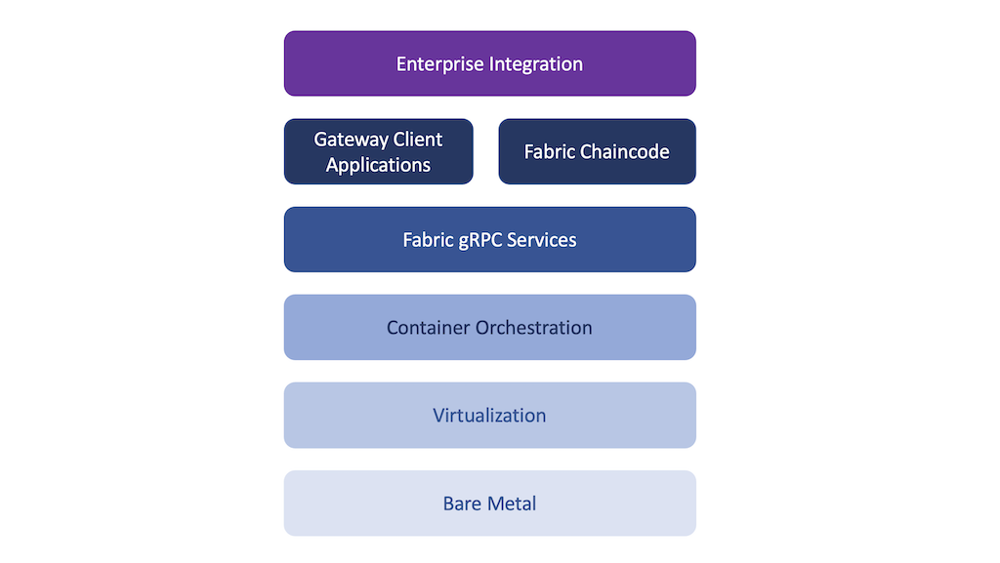

# Cloud Ready!

==> [NEXT: Deploy a Kube](./10-kube.md)

---

Cloud Native Hyperledger Fabric provides a neutral, tiered perspective of a Hyperledger Fabric Network as an integration of
containers, service endpoints, and API abstractions.  In this module of the workshop, you will assemble a complete
application, building up from a local development running in isolation to a complete blockchain application running
natively on a public cloud.




Each _application tier_ in the cloud native fabric stack is generally _modular_, and carries over with minimal change to
switch between different environments.  At each _application tier_, client libraries and connection URLs are used to
ensure portability and independence across runtime stacks.

For instance:

- All interaction with Fabric peers, orderers, and CAs is performed with native binaries, communicating natively via
  TCP and gRPCs.  After the Fabric network has been established, all administrative and ledger access
  (channel creation, user enrollment, chaincode installation, Gateway Client connections, etc.) occurs via service URL.
  From the integration tier, a Fabric network is just "running somewhere" and expressed as a set of service URLs and
  x509 certificates.

- All interaction with the container orchestrator is performed directly via access to the Kubernetes API controller.  In
  several scenarios in the workshop, you will issue `kubectl` commands from a local system after configuring the client
  to connect to a cluster "running somewhere."  Note that this approach does not distinguish between a k8s cluster
  running locally on the laptop, embedded on a Virtual Machine, or a fully cloud-native vendor such as AKS, EKS, or IKS.
  
- In some cases a virtualization layer is necessary to emulate the cloud-native practices.  For instance, a VM running
  locally with multipass/vagrant (or a remote instance at EC2) can be used to supplement a local development workflow.
  This can be extremely useful as a means to build platform-neutral runtimes, supporting a variety of chipsets and
  development environments (WSL2, Mac M1, z/OS, amd64, etc.)


At some point when working with a _Cloud Native Fabric_ stack, you will feel _mildly disoriented_.  When you are 
_feeling lost_, focus on the tiered stack above to help re-orient yourself, find a compass bearing, and move forward.
In general, each application tier is designed to work only with the immediate layer beneath it in the stack.

Here are some key points to keep in mind to help stay "grounded" on your voyage to the cloud:

1. Services are backed by URLs.  (It does not matter _where_ the endpoints are running, only how you _locate_ them.)

2. Services run in [OCI Containers](https://github.com/opencontainers/image-spec) and are orchestrated by Kubernetes.

3. All client programs run on your machine, connecting to service endpoints "running somewhere" on a hybrid cloud. 

4. At some point in this course, you may encounter a chaincode contract running in a Java Virtual Machine, running in a
   docker container, executing as a service running on Kubernetes, which is running in a Docker container, which
   is running on a virtual machine, which is running on an x86 emulation layer, which is running on hyperkit, which is
   running on Mac M1 silicon on your laptop.  At many times, you will forget _where_ your code is running, and question
   if it is in fact running at all.  Do not be alarmed:  this is a natural reaction to container based application
   workflows.  (See points 1, 2, and 3 above.)


## Ready?

```shell
# If the check passes, proceed to "Deploy a Kube":
./check.sh
```


## Not Ready?

To run the cloud workshop, a number of client applications are necessary to interact with the Fabric application tiers.

Install the workshop prerequisites with instructions from running `./check.sh`, or see detailed guides from the web:

- [fabric-samples](https://github.com/hyperledger/fabric-samples) (This GitHub project):
```shell
git clone https://github.com/hyperledger/fabric-samples.git fabric-samples
cd fabric-samples/full-stack-asset-transfer-guide
```

- [docker](https://www.docker.com/get-started/)

- [kubectl](https://kubernetes.io/docs/tasks/tools/)

- [jq](https://stedolan.github.io/jq/download/)

- [k9s](https://k9scli.io/topics/install/) (recommended)

- Hyperledger Fabric [client binaries](https://hyperledger-fabric.readthedocs.io/en/latest/install.html#download-fabric-samples-docker-images-and-binaries):
```shell

curl -sSL https://raw.githubusercontent.com/hyperledger/fabric/main/scripts/install-fabric.sh | bash -s -- binary

```

- Workshop environment variables:
```shell

export WORKSHOP_PATH=$(pwd)
export FABRIC_CFG_PATH=${WORKSHOP_PATH}/config  
export PATH=${WORKSHOP_PATH}/bin:$PATH

```

## Still not Ready?

For the duration of the workshop, a number of temporary, short-run virtual machines will be available on the web for
your usage.  The systems have been provisioned with a [#cloud-config](../../infrastructure/ec2-cloud-config.yaml) and
include all dependencies necessary to run the cloud-native workshop.  Check your "Conga Card" for the instance IP and
ssh connection details.


--- 

==> [NEXT: Deploy a Kube](./10-kube.md)
