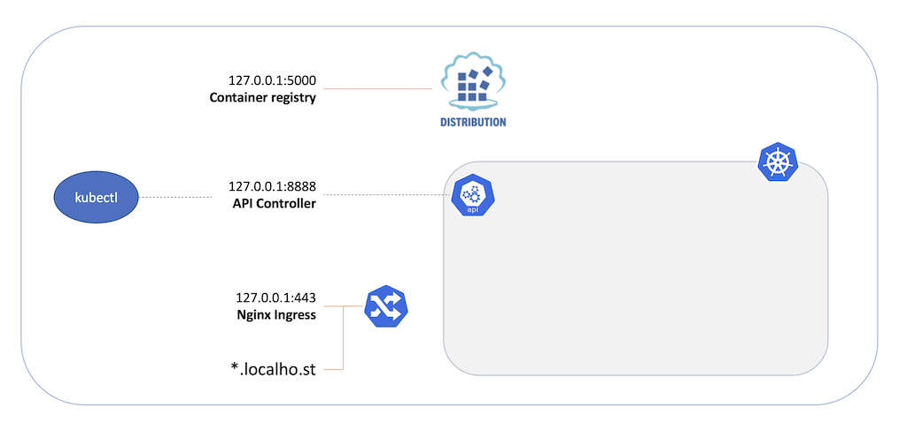

# Deploy a Kubernetes Cluster

[PREV: Setup](00-setup.md) <==> [NEXT: Deploy a Fabric Network](20-fabric.md)

---

With cloud-native Fabric, all the components can run directly on your development workstation.  In this exercise, you will configure:

- A local [kind](https://kind.sigs.k8s.io) cluster, running Kubernetes in Docker.

- A local [Ingress controller](https://github.com/kubernetes/ingress-nginx), routing traffic into the cluster at the `*.localho.st` virtual DNS domain.

- A local [Container Registry](https://docs.docker.com/registry/insecure/), allowing you to upload chaincode Docker images to the cluster.




## Ready?

```shell

just check-setup 

```

## Kubernetes IN Docker (KIND)

- Set the cluster ingress domain and target k8s namespace.  The `localho.st` domain is a public DNS wildcard resolver
  mapping `*.localho.st` to 127.0.0.1.
```shell

export WORKSHOP_INGRESS_DOMAIN=localho.st
export WORKSHOP_NAMESPACE=test-network

```

- Create a [kind](https://kind.sigs.k8s.io) cluster, Nginx ingress, and local container registry:
```shell

just kind

```

- Open a new terminal window and observe the target namespace:
```shell

# KIND will set the current kubectl context in ~/.kube/config 
kubectl cluster-info

k9s -n test-network

```


## Trouble? 

- Run KIND on a [multipass VM](11-kube-multipass.md) on your local system
- Run KIND on an [EC2 instance](12-kube-ec2-vm.md) at AWS


## Take it Further: 

- Run the workshop on an [IKS or EKS or DOKS Cloud Kubernetes cluster](13-kube-public-cloud.md).
- Run the workshop on an AWS VM, using your AWS account and an EC2 [#cloud-config](../../infrastructure/ec2-cloud-config.yaml).

---
[PREV: Setup](00-setup.md) <==> [NEXT: Deploy a Fabric Network](20-fabric.md)

