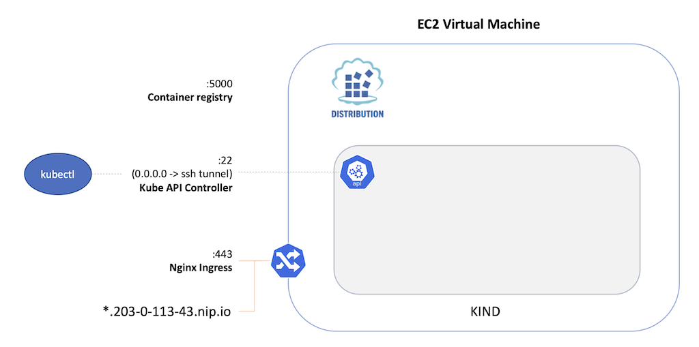

# Deploy a Kubernetes Cluster

[PREV: Setup](00-setup.md) <==> [NEXT: Deploy a Fabric Network](20-fabric.md)

---

When working with a cloud native Fabric stack, it is possible to connect the client application binaries
(`kubectl`, `peer`, `node`, etc.) to a Kubernetes cluster running on a remote virtual machine.  In this
scenario, you will provision a VM instance at EC2, install a KIND cluster on the VM, and forward a local
port to the remote API controller with SSH.  This configuration can be extremely useful in scenarios
where the local system does not have sufficient resources to "run everything," or when a local development
is focused on client-application development and Fabric needs to "just run somewhere."

This configuration is also an effective way to minimize usage costs associated with a "full Kubernetes"
deployment on cloud vendors, enabling a natural k8s development workflow on disposable, temporary VMs. 




## Provision a Virtual Machine Instance at EC2 

**Note:** If you are participating in the workshop, an EC2 VM will be made available to you for the duration of the
event.  Check your Conga Card for connection details and IP address of the remote VM.

To create a new EC2 instance with software dependencies pre-installed via [#cloud-init](../../infrastructure/ec2-cloud-config.yaml):

- Log in to AWS
- Use `t2.xlarge` profile (4 CPU / 8 GRAM / 80 GB gp2)
- open ports 80 (nginx), 443 (nginx), and 5000 (container registry)
- copy/paste `infrastructure/ec2-cloud-config.yaml` as the instance user-data
- Create an ssh key pair for remote login.  Save locally as `~/Downloads/ec2-key.pem`
- After the instance is up, identify the PUBLIC IPV4 address.  This will be used extensively for all access to the cluster:

If you are working with a pre-existing VM, connect to the remote system and add your ~/.ssh/id-rsa.pub key to
the ubuntu user's `.ssh/authorized_keys` file.  In the examples below, omit the `-i ${EC2_INSTANCE_KEY}` command
arguments.


## SSH Port Forward to the k8s API Controller

- Start a new shell on the host OS and input the instance public IPv4 address and ssh public key.
```shell

# Set to your EC2 instance Public IPv4 address and SSH connection key.  E.g.:
export EC2_INSTANCE_IP=203.0.113.42
export EC2_INSTANCE_KEY=~/Downloads/ec2-key.pem

```

- Open an [ssh port forward](https://help.ubuntu.com/community/SSH/OpenSSH/PortForwarding) and interactive shell on the
  remote system.  While this terminal is open, all traffic directed to the host OS port 8888 will be tunneled to the k8s
  API controller running on the remote VM.  This presents the illusion to kubectl that the cluster is running locally,
  when in fact the k8s client is communicating with the remote instance running at AWS.
```shell

ssh -i $EC2_INSTANCE_KEY -L 8888:127.0.0.1:8888 ubuntu@${EC2_INSTANCE_IP}

```


## Kubernetes IN Docker (KIND)

- Clone the project source code and create a KIND cluster on the remote VM:
```shell

git clone https://github.com/hyperledgendary/full-stack-asset-transfer-guide.git
cd full-stack-asset-transfer-guide 

# Bind a docker container registry to the VM's external IP  
export CONTAINER_REGISTRY_ADDRESS=0.0.0.0
export CONTAINER_REGISTRY_PORT=5000

# Create a Kubernetes cluster in Docker, configure an Nginx ingress, and docker container registry
just kind 

```

- Leave this terminal window open in the background and observe the target k8s namespace.  When this ssh session
  is terminated, the ssh port forward will be closed and the host OS will no longer be able to connect to the remote
  kubernetes cluster.
```shell

k9s -n test-network

```


## Connect kubectl to the Remote Cluster:

In the original shell opened for the workshop on your local system: 

- Copy the kube config from the remote system to the local user account:
```shell

scp -i $EC2_INSTANCE_KEY ubuntu@${EC2_INSTANCE_IP}:~/.kube/config ~/.kube/config

```

- Test the connectivity to the remote cluster. 
```shell
$ kubectl cluster-info
Kubernetes control plane is running at https://127.0.0.1:8888
CoreDNS is running at https://127.0.0.1:8888/api/v1/namespaces/kube-system/services/kube-dns:dns/proxy

To further debug and diagnose cluster problems, use 'kubectl cluster-info dump'.
```


## Network DNS Ingress Domain

- Set the cluster ingress domain to an nip.io resolver.  All virtual hosts in this domain will resolve to the nginx ingress.
```shell

export WORKSHOP_INGRESS_DOMAIN=$(echo $EC2_INSTANCE_IP | cut -d ' ' -f 1 | tr -s '.' '-').nip.io
export WORKSHOP_NAMESPACE=test-network

```

- Double-check that you are able to access a virtual host at the remote ingress domain.  The expected response
  is an HTTP 404 from nginx:
```
$ curl foo.${WORKSHOP_INGRESS_DOMAIN}
<html>
<head><title>404 Not Found</title></head>
<body>
<center><h1>404 Not Found</h1></center>
<hr><center>nginx</center>
</body>
</html>
```


---
[PREV: Setup](00-setup.md) <==> [NEXT: Deploy a Fabric Network](20-fabric.md)

