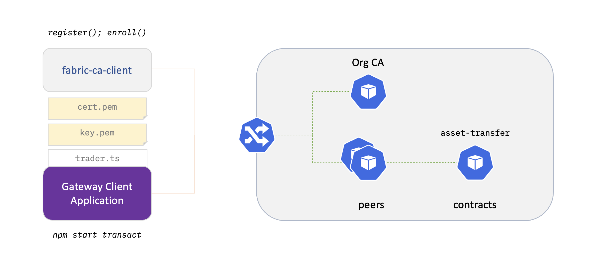

# Gateway Client Application

[PREV: Install Chaincode](30-chaincode.md) <==> [NEXT: Teardown](90-teardown.md)

---

In this final workshop exercise, we will port the Gateway Client routines you developed in the
[ApplicationDev](../ApplicationDev) module to run on a cloud-native Fabric network.

In order to query the ledger and submit transactions to the `asset-transfer` smart contract, the client application
must run with an identity certificate and key pair issued by the organization's CA.  Once the user identity has
been enrolled with the CA, we'll use the new identity to create, transfer, and exchange virtual "token" assets
on a shared ledger.




## Ready?

```shell

just check-chaincode

```


## Register and enroll a new user at the org CA

```shell

# User organization MSP ID
export MSP_ID=Org1MSP        
export ORG=org1
export USERNAME=org1user
export PASSWORD=org1userpw

```

```shell

ADMIN_MSP_DIR=$WORKSHOP_CRYPTO/enrollments/${ORG}/users/rcaadmin/msp
USER_MSP_DIR=$WORKSHOP_CRYPTO/enrollments/${ORG}/users/${USERNAME}/msp
PEER_MSP_DIR=$WORKSHOP_CRYPTO/channel-msp/peerOrganizations/${ORG}/msp

fabric-ca-client  register \
  --id.name       $USERNAME \
  --id.secret     $PASSWORD \
  --id.type       client \
  --url           https://$WORKSHOP_NAMESPACE-$ORG-ca-ca.$WORKSHOP_INGRESS_DOMAIN \
  --tls.certfiles $WORKSHOP_CRYPTO/cas/$ORG-ca/tls-cert.pem \
  --mspdir        $WORKSHOP_CRYPTO/enrollments/$ORG/users/rcaadmin/msp

fabric-ca-client enroll \
  --url           https://$USERNAME:$PASSWORD@$WORKSHOP_NAMESPACE-$ORG-ca-ca.$WORKSHOP_INGRESS_DOMAIN \
  --tls.certfiles $WORKSHOP_CRYPTO/cas/$ORG-ca/tls-cert.pem \
  --mspdir        $WORKSHOP_CRYPTO/enrollments/$ORG/users/$USERNAME/msp

mv $USER_MSP_DIR/keystore/*_sk $USER_MSP_DIR/keystore/key.pem

```

## Go Bananas

- Set the gateway client to connect to the org1-peer1 as the newly enrolled `${USERNAME}`:
```shell

# Path to private key file
export PRIVATE_KEY=${USER_MSP_DIR}/keystore/key.pem

# Path to user certificate file
export CERTIFICATE=${USER_MSP_DIR}/signcerts/cert.pem

# Path to CA certificate
export TLS_CERT=${PEER_MSP_DIR}/tlscacerts/tlsca-signcert.pem

# Gateway peer SSL host name override
export HOST_ALIAS=${WORKSHOP_NAMESPACE}-${ORG}-peer1-peer.${WORKSHOP_INGRESS_DOMAIN}

# Gateway endpoint
export ENDPOINT=$HOST_ALIAS:443

```

```shell

pushd applications/trader-typescript

npm install

```

```shell

# Create a yellow banana token owned by appleman@org1 
npm start create banana bananaman yellow

npm start getAllAssets

# Transfer the banana among users / orgs 
npm start transfer banana appleman Org1MSP

npm start getAllAssets

# Transfer the banana among users / orgs 
npm start transfer banana bananaman Org2MSP

# Error! Which org owns the banana? 
npm start transfer banana bananaman Org1MSP

popd

```

# Take it Further 

## Gateway Load Balancing

In the example above, the gateway client connects directly to a peer using the specific peer node's 
gRPCs URL.  This can be extended with a level of fail-over and load balancing, by instructing the gateway 
client to connect at a virtual host Ingress and Kubernetes Service.  When connecting in this fashion,
Gateway client connections are load balanced across the org's peers in the network, with the gateway
peer further dispatching transaction requests to peers while maintaining a balanced ledger height.


To set up a load-balanced Gateway [Service and Ingress](../../infrastructure/sample-network/config/gateway/org1-peer-gateway.yaml) URL in Kubernetes:


- Create a virtual host name / Ingress endpoint for the org peers: 
```shell
pushd applications/trader-typescript

kubectl kustomize \
  ../../infrastructure/sample-network/config/gateway \
  | envsubst \
  | kubectl -n ${WORKSHOP_NAMESPACE} apply -f -  

```

- Run the gateway client application, using the load-balanced Gateway service.  When the gateway client 
connects to the network, the gRPCs connections will be distributed across peers in the org:
```shell

unset HOST_ALIAS
export ENDPOINT=${WORKSHOP_NAMESPACE}-org1-peer-gateway.${WORKSHOP_INGRESS_DOMAIN}:443

npm start getAllAssets

popd
```

Note that in order to support ingress and host access with the new virtual domain, the peer 
CRDs have been instructed to [designate an additional SAN alias](../../infrastructure/sample-network/config/peers/org1-peer1.yaml#L69)
/ host name when provisioning the node TLS certificate with the CA.


---

[PREV: Install Chaincode](30-chaincode.md) <==> [NEXT: Teardown](90-teardown.md)
