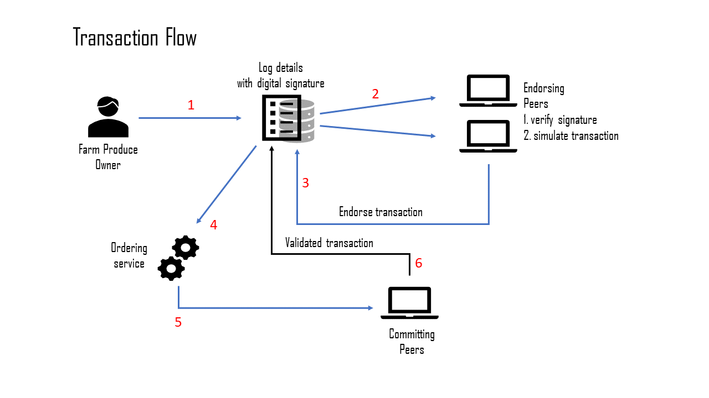

# farm-chain POC with Fabric v1.4
---

## Setting up Hyperledger Fabric and Dependencies

### Remove any pre-existing containers and images:

``$ docker rm -f $(docker -q)`` \
``$ docker rmi -f $(docker ps -aq)``

If you have not used docker previously on the same machine follow the step 1.

1. Docker - Guide (https://www.digitalocean.com/community/tutorials/how-to-install-and-use-docker-on-ubuntu-18-04)
2. NodeJS - Guide (https://www.digitalocean.com/community/tutorials/how-to-install-node-js-on-ubuntu-18-04)
3. Hyperledger Fabric v1.4 and above 


### Setup Golang language:
```bash
curl -O https://storage.googleapis.com/golang/go1.11.1.linux-amd64.tar.gz
sha256sum go1.11.1.linux-amd64.tar.gz
tar -xvf go1.11.1.linux-amd64.tar.gz
sudo mv go /usr/local
```
Add the following paths to the bashrc file
```bash
export GOPATH=$HOME/go
export PATH=$PATH:/usr/local/go/bin:$GOPATH/bin
```
Re-source the bash script
```bash
source ~/.bashrc
source ~/.bashrc
```

### Get fabric-samples and install  
```
git clone https://github.com/hyperledger/fabric-samples.git
```
From the root level of the fabric-samples directory: 
```
$ ./scripts/bootstrap.h 
```

## Start the Hyperledger Fabric network for the POC
From the root level of this project

```
$ ./startFabric.sh >&logs/startup_logs.txt
```

On first run of the project: install the required node js libraries, register the Admin and User components of our network, and start the server:

```
$ npm install
```
If this throws some errors, try running ``$ npm update`` and then ``$npm install``

Enroll the admin user:
```
$ node enrollAdmin.js 
```
Expected output:
```markdown
Store path:/home/sakya/.hfc-key-store
Successfully loaded admin from persistence
Assigned the admin user to the fabric client ::{"name":"admin","mspid":"Org1MSP","roles":null,"affiliation":"","enrollmentSecret":"","enrollment":{"signingIdentity":"091d15d647a3053a769faf8f4122e7ac577323b919d00413d6f4e2208337eee9","identity":{"certificate":"-----BEGIN CERTIFICATE-----\nMIICATCCAaigAwIBAgIUTyI7MAMMLUNlJt7m+dPVhKZKvXgwCgYIKoZIzj0EAwIw\nczELMAkGA1UEBhMCVVMxEzARBgNVBAgTCkNhbGlmb3JuaWExFjAUBgNVBAcTDVNh\nbiBGcmFuY2lzY28xGTAXBgNVBAoTEG9yZzEuZXhhbXBsZS5jb20xHDAaBgNVBAMT\nE2NhLm9yZzEuZXhhbXBsZS5jb20wHhcNMTkwNTAzMDUyMTAwWhcNMjAwNTAyMDUy\nNjAwWjAhMQ8wDQYDVQQLEwZjbGllbnQxDjAMBgNVBAMTBWFkbWluMFkwEwYHKoZI\nzj0CAQYIKoZIzj0DAQcDQgAE0i55Xns6VEn2Y+DUNgQR3bfbLz40B99srq5rKF+C\n8QH6A3lDMtN7dFJQvddZprSxNaScaA81sJzXmygJ/9qBzaNsMGowDgYDVR0PAQH/\nBAQDAgeAMAwGA1UdEwEB/wQCMAAwHQYDVR0OBBYEFNyNLIJjiV6+GK97W/DO7a30\nLbUbMCsGA1UdIwQkMCKAIEI5qg3NdtruuLoM2nAYUdFFBNMarRst3dusalc2Xkl8\nMAoGCCqGSM49BAMCA0cAMEQCIGe2ilQJ9PNaPueLFL9Joc9zaV7Eq0krEX1wBR8c\nWCE/AiBdDgWhzztwAtdsV7/y6NXkmvCcJQvgtmz/ga+7gcolIQ==\n-----END CERTIFICATE-----\n"}}}

```
Enroll the normal user:
```
$ node enrollUser.js  
```
If you received the following error: ``Failed to register: Error: fabric-ca request register failed with errors [[{"code":20,"message":"Authentication failure"}]]``

remove the keys from hfc-key-store: ``rm -rf ~/.hfc-key-store/*
``
After this, re-enroll the admin and normal user. Successful completion of ``$node enrollUser.js`` should give the following output:

```markdown
Successfully loaded admin from persistence
Successfully registered user1 - secret:MPGQrXnJyxjc
Successfully enrolled member user "user1" 
User1 was successfully registered and enrolled and is ready to intreact with the fabric network

```


*Start the server and browse to ``localhost:8000`` in order to interact with the POC network and ledger*
```
$ node server.js >&logs/server_logs.txt
```

```markdown
NOTE: All console logs will be stored in the ``logs`` directory. 
```

### Transaction flow in the network


### Stakeholders in the network
1. Farmer -> invokes - recordProduce()
2. Buyer  -> invokes - queryProduce() / changeProduceOwner()
3. Regulator -> invokes - queryProduce() / queryAllProduce()
