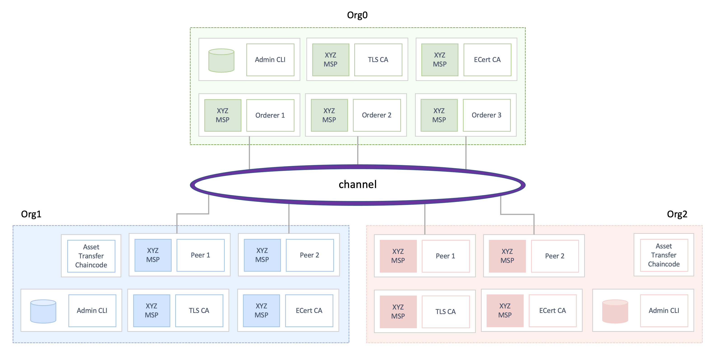

# Kubernetes Test Network

Starting in release 2.0, Hyperledger introduced the [test-network](https://hyperledger-fabric.readthedocs.io/en/latest/test_network.html)
to serve as both an accelerator and learning resource for running Fabric networks.  In addition to
providing a study guide for operational patterns, the test-network provided a baseline environment for members of
the Fabric community to quickly get up to speed with a working, local system, author smart contracts, and develop
simple blockchain applications.

As a supplement to the docker-compose based test-network, this guide presents an equivalent Fabric network 
suitable for running sample applications and chaincode, developing Gateway and Chaincode-as-a-Service applications, 
and harmonizing CI and deployment flows with a unified container framework - Kubernetes.

Similar to Fabric, Kubernetes introduces a steep learning curve and presents a dizzying array of operational
flexibility.  In this guide, we'll outline the design considerations in the [`./network`](../network)
scripts, provide a supplement to the [Fabric CA Deployment Guide](https://hyperledger-fabric-ca.readthedocs.io/en/latest/deployguide/ca-deploy.html),
and build up to a reference model for realistic production deployments on Kubernetes.

_Ahoy!_

## Network Topology  

The Kube test network establishes as consortium among a dedicated ordering organization and two peer organizations.
Participation in the network is managed over a channel, and transactions are committed to the blockchain ledgers by
invoking the [asset-transfer-basic](https://github.com/hyperledgendary/fabric-ccaas-asset-transfer-basic)
_Chaincode-as-a-Service_ running in a shared Kubernetes namespace.

## Detailed Guides

- [Working with Kubernetes](KUBERNETES.md)
- [Certificate Authorities](CA.md)
  - [Planning for a CA](CA.md#planning-for-a-ca)
  - [Deploy the TLS CAs](CA.md#deploy-tls-ca-issuers)
  - [Deploy the ECert CAs](CA.md#deploy-the-organization-ca)
- [Launching the Test Network](TEST_NETWORK.md)
  - [Registering and Enrolling Identities](CA.md#registering-and-enrolling-identities)
  - [Assembling Node MSPs](TEST_NETWORK.md#fabric-node-msp-context)
  - [Deploy Orderers and Peers](TEST_NETWORK.md#starting-peers-and-orderers)
- [Working with Channels](CHANNELS.md)
- [Working with Chaincode](CHAINCODE.md)
- [Debugging Chaincode](CHAINCODE_AS_A_SERVICE.md)
- [Working with Applications](APPLICATIONS.md)
- [High Availability](HIGH_AVAILABILITY.md)
